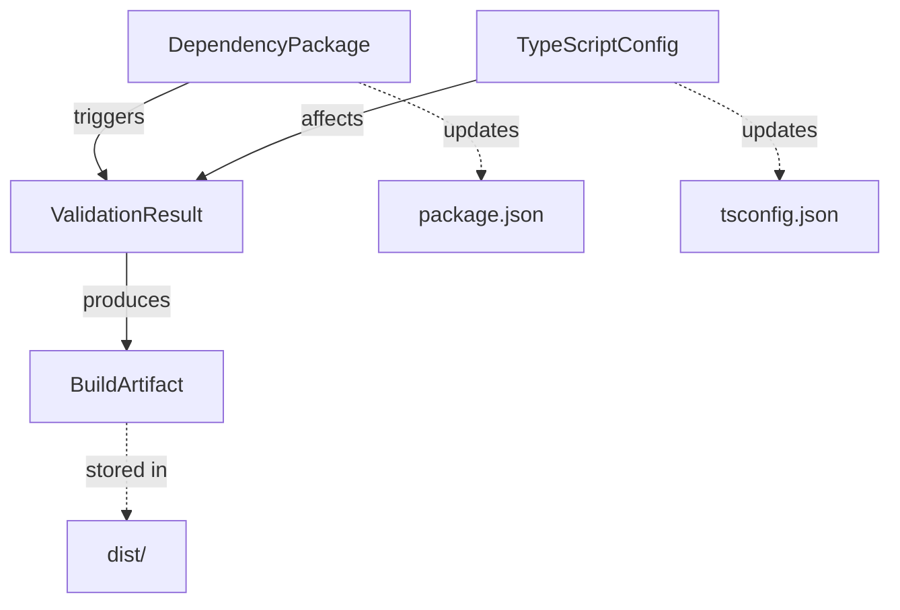

# Data Model: 階段 1 安全升級 - 型別定義與 TypeScript 目標

**Spec**: [spec.md](./spec.md) | **Plan**: [plan.md](./plan.md)  
**Date**: 2025-01-26 | **Status**: Phase 1 設計完成

## 概述

本資料模型定義安全型別升級功能所需的四個核心實體。這些實體用於追蹤升級過程、驗證結果和配置變更。

**設計原則**:

-   **不可變性 (Principle III)**: 所有實體屬性為唯讀
-   **純數據結構**: 不包含業務邏輯,僅作為資料傳遞載體
-   **類型安全**: 所有屬性明確定義 TypeScript 型別

---

## 核心實體 (Core Entities)

### 1. DependencyPackage (依賴套件)

**用途**: 表示單一 npm 套件的升級資訊

**屬性**:

```typescript
interface DependencyPackage {
	/** 套件名稱 (例: "@types/vscode") */
	readonly name: string;

	/** 當前安裝版本 */
	readonly currentVersion: string;

	/** 目標升級版本 */
	readonly targetVersion: string;

	/** 升級類型 (major/minor/patch) */
	readonly updateType: 'major' | 'minor' | 'patch';

	/** 是否為開發依賴 */
	readonly isDev: boolean;

	/** 套件在 package.json 中的位置 */
	readonly location: 'dependencies' | 'devDependencies';
}
```

**範例**:

```typescript
const vscodeDep: DependencyPackage = {
	name: '@types/vscode',
	currentVersion: '1.96.0',
	targetVersion: '1.105.0',
	updateType: 'minor',
	isDev: true,
	location: 'devDependencies',
};

const nodeDep: DependencyPackage = {
	name: '@types/node',
	currentVersion: '20.19.22',
	targetVersion: '22.12.0',
	updateType: 'major',
	isDev: true,
	location: 'devDependencies',
};
```

**驗證規則**:

-   `name` 必須符合 npm 套件命名規範
-   `currentVersion` 和 `targetVersion` 必須為有效的 semver 版本
-   `updateType` 必須根據 semver 規則正確分類:
    -   `major`: 主版本號變更 (例: 20.x → 22.x)
    -   `minor`: 次版本號變更 (例: 1.96.0 → 1.105.0)
    -   `patch`: 修訂版本號變更 (例: 1.96.0 → 1.96.1)

---

### 2. ValidationResult (驗證結果)

**用途**: 記錄升級後的驗證結果,包含測試、覆蓋率和建置時間

**屬性**:

```typescript
interface ValidationResult {
	/** 驗證時間戳記 (ISO 8601 格式) */
	readonly timestamp: string;

	/** 驗證階段名稱 */
	readonly checkpointName: string;

	/** 測試通過數量 */
	readonly testsPassed: number;

	/** 測試失敗數量 */
	readonly testsFailed: number;

	/** 測試總數 */
	readonly testsTotal: number;

	/** 程式碼覆蓋率百分比 (0-100) */
	readonly coveragePercent: number;

	/** 編譯/建置時間 (毫秒) */
	readonly buildTimeMs: number;

	/** 驗證是否通過 */
	readonly passed: boolean;

	/** 錯誤訊息 (若失敗) */
	readonly errorMessage?: string;
}
```

**範例**:

```typescript
const checkpointResult: ValidationResult = {
	timestamp: '2025-01-26T10:30:00.000Z',
	checkpointName: 'checkpoint-2-test-suite',
	testsPassed: 190,
	testsFailed: 0,
	testsTotal: 190,
	coveragePercent: 87.21,
	buildTimeMs: 19600,
	passed: true,
};

const failedResult: ValidationResult = {
	timestamp: '2025-01-26T10:35:00.000Z',
	checkpointName: 'checkpoint-1-type-check',
	testsPassed: 0,
	testsFailed: 0,
	testsTotal: 0,
	coveragePercent: 0,
	buildTimeMs: 4200,
	passed: false,
	errorMessage: 'Type error in src/extension.ts:42',
};
```

**驗證規則**:

-   `timestamp` 必須為有效的 ISO 8601 時間戳記
-   `coveragePercent` 範圍: 0.0 - 100.0
-   `passed` 應根據以下規則計算:
    -   `testsFailed === 0` (若有測試執行)
    -   `coveragePercent >= 87.21` (維持基準覆蓋率)
    -   `buildTimeMs > 0` (成功完成建置)

---

### 3. BuildArtifact (建置產物)

**用途**: 追蹤編譯產物的檔案資訊,用於比較升級前後的變化

**屬性**:

```typescript
interface BuildArtifact {
	/** 檔案完整路徑 */
	readonly filePath: string;

	/** 檔案大小 (bytes) */
	readonly sizeBytes: number;

	/** 建置時間戳記 (ISO 8601 格式) */
	readonly timestamp: string;

	/** 檔案 SHA-256 校驗碼 */
	readonly checksum: string;

	/** 相對於基準線的大小變化百分比 */
	readonly sizeChangePct?: number;

	/** 基準線檔案大小 (bytes, 用於計算變化) */
	readonly baselineSizeBytes?: number;
}
```

**範例**:

```typescript
const extensionArtifact: BuildArtifact = {
	filePath: 'E:\\singular-blockly\\dist\\extension.js',
	sizeBytes: 132018,
	timestamp: '2025-01-26T10:40:00.000Z',
	checksum: 'a1b2c3d4e5f6...',
	sizeChangePct: 1.16, // (132018 - 130506) / 130506 * 100
	baselineSizeBytes: 130506,
};
```

**驗證規則**:

-   `sizeBytes` 必須 > 0
-   `sizeChangePct` 計算公式: `(sizeBytes - baselineSizeBytes) / baselineSizeBytes * 100`
-   成功標準: `Math.abs(sizeChangePct) <= 5.0` (±5% 容忍範圍)

---

### 4. TypeScriptConfig (TypeScript 配置)

**用途**: 表示 tsconfig.json 的關鍵配置項,用於追蹤升級變更

**屬性**:

```typescript
interface TypeScriptConfig {
	/** 編譯目標 (ES5/ES2015/.../ES2023/ESNext) */
	readonly target: string;

	/** 包含的標準函式庫 (例: ["ES2023"]) */
	readonly lib: string[];

	/** 其他編譯選項 (key-value pairs) */
	readonly compilerOptions: Record<string, unknown>;

	/** 配置檔案路徑 */
	readonly configPath: string;

	/** 最後修改時間戳記 */
	readonly lastModified: string;
}
```

**範例**:

```typescript
// 升級前配置
const beforeConfig: TypeScriptConfig = {
	target: 'ES2022',
	lib: ['ES2022'],
	compilerOptions: {
		module: 'commonjs',
		outDir: './dist',
		sourceMap: true,
		strict: true,
	},
	configPath: 'E:\\singular-blockly\\tsconfig.json',
	lastModified: '2025-01-20T08:00:00.000Z',
};

// 升級後配置
const afterConfig: TypeScriptConfig = {
	target: 'ES2023',
	lib: ['ES2023'],
	compilerOptions: {
		module: 'commonjs',
		outDir: './dist',
		sourceMap: true,
		strict: true,
	},
	configPath: 'E:\\singular-blockly\\tsconfig.json',
	lastModified: '2025-01-26T10:45:00.000Z',
};
```

**驗證規則**:

-   `target` 必須為有效的 TypeScript 目標值
-   `lib` 陣列必須包含至少一個有效的函式庫名稱
-   升級後 `target` 和 `lib` 必須一致 (例: target=ES2023 → lib=["ES2023"])

---

## 實體關係圖 (Entity Relationship)



**關係說明**:

1. `DependencyPackage` 升級觸發 `ValidationResult` 驗證流程
2. `TypeScriptConfig` 變更影響編譯結果,產生新的 `ValidationResult`
3. 驗證通過後產生 `BuildArtifact` (dist/extension.js)
4. 虛線表示實體與檔案系統的關係

---

## 資料流程 (Data Flow)

### 升級流程

```
1. 讀取 package.json → 建立 DependencyPackage 實例
   ↓
2. 更新 package.json → 執行 npm install
   ↓
3. 讀取 tsconfig.json → 建立 TypeScriptConfig 實例 (before)
   ↓
4. 更新 tsconfig.json → 修改 target & lib
   ↓
5. 執行驗證檢查點:
   - Checkpoint 1: 型別檢查 → ValidationResult
   - Checkpoint 2: 測試套件 → ValidationResult
   - Checkpoint 3: 建置產物 → BuildArtifact
   ↓
6. 建立 TypeScriptConfig 實例 (after)
   ↓
7. 比較前後配置 + 驗證結果 → 產生升級報告
```

### 資料儲存

**重要**: 這些實體僅用於升級過程中的資料傳遞,**不持久化儲存**。

**原因**:

-   符合 Principle VIII (純函數標準) - 實體為不可變資料結構
-   升級為一次性操作,不需要長期儲存狀態
-   驗證結果記錄於 Git commit 和 CHANGELOG.md

---

## 使用範例 (Usage Examples)

### 範例 1: 建立升級追蹤

```typescript
// 定義要升級的套件
const packages: DependencyPackage[] = [
	{
		name: '@types/vscode',
		currentVersion: '1.96.0',
		targetVersion: '1.105.0',
		updateType: 'minor',
		isDev: true,
		location: 'devDependencies',
	},
	{
		name: '@types/node',
		currentVersion: '20.19.22',
		targetVersion: '22.12.0',
		updateType: 'major',
		isDev: true,
		location: 'devDependencies',
	},
];

// 追蹤升級進度
console.log(`準備升級 ${packages.length} 個套件:`);
packages.forEach(pkg => {
	console.log(`- ${pkg.name}: ${pkg.currentVersion} → ${pkg.targetVersion} (${pkg.updateType})`);
});
```

### 範例 2: 執行驗證並記錄結果

```typescript
// 執行測試並建立驗證結果
function runTests(): ValidationResult {
	const startTime = Date.now();

	// 執行測試套件 (假設函數)
	const testResults = executeTestSuite();

	const endTime = Date.now();

	return {
		timestamp: new Date().toISOString(),
		checkpointName: 'checkpoint-2-test-suite',
		testsPassed: testResults.passed,
		testsFailed: testResults.failed,
		testsTotal: testResults.total,
		coveragePercent: testResults.coverage,
		buildTimeMs: endTime - startTime,
		passed: testResults.failed === 0 && testResults.coverage >= 87.21,
	};
}

// 使用範例
const result = runTests();
if (result.passed) {
	console.log('✅ 驗證通過!');
} else {
	console.error('❌ 驗證失敗:', result.errorMessage);
}
```

### 範例 3: 比較建置產物

```typescript
// 比較升級前後的建置產物大小
function compareArtifacts(before: BuildArtifact, after: BuildArtifact): boolean {
	const sizeChange = ((after.sizeBytes - before.sizeBytes) / before.sizeBytes) * 100;

	console.log(`建置產物大小變化: ${sizeChange.toFixed(2)}%`);
	console.log(`- 升級前: ${before.sizeBytes} bytes`);
	console.log(`- 升級後: ${after.sizeBytes} bytes`);

	const acceptable = Math.abs(sizeChange) <= 5.0;
	return acceptable;
}
```

---

## 型別定義檔案位置

**注意**: 本專案不需要實際建立這些 TypeScript 介面檔案,因為:

1. 升級為一次性操作,不需要持久化程式碼
2. 實體用於文件化和理解升級流程
3. 實際驗證使用現有測試框架 (Mocha) 和 npm 指令

**若未來需要程式化追蹤**,建議位置:

```
src/upgrade/
├── types.ts              # 定義所有實體介面
└── validator.ts          # 驗證邏輯 (純函數)
```

---

## 設計決策記錄

### 決策 1: 不使用類別 (Classes)

**原因**:

-   符合 Principle III (純函數) - 避免可變狀態
-   簡單資料結構更易於序列化和傳遞
-   不需要方法或行為,僅作為資料載體

**替代方案**: 使用 TypeScript 介面 (interfaces) 定義唯讀屬性

### 決策 2: 不持久化儲存

**原因**:

-   升級為一次性操作,不需要資料庫或檔案儲存
-   Git commit 和 CHANGELOG.md 已提供追蹤機制
-   減少複雜度,符合 Principle VI (預防優先)

**替代方案**: 驗證結果記錄於終端輸出和 Git 歷史

### 決策 3: 使用 ISO 8601 時間戳記

**原因**:

-   標準格式,易於解析和比較
-   支援跨時區操作
-   TypeScript `Date` 物件原生支援

**範例**: `2025-01-26T10:30:00.000Z`

---

**資料模型完成日期**: 2025-01-26  
**審核狀態**: ✅ 準備建立契約 (contracts/)  
**下一步**: 建立三個驗證檢查點契約檔案
