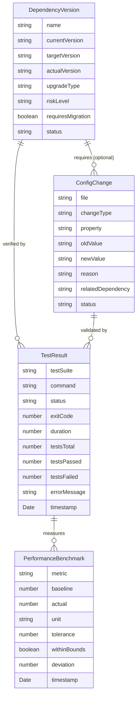

# Data Model: Dev Tools Dependency Upgrade

**Feature**: 009-dev-tools-upgrade  
**Phase**: 1 - Design  
**Date**: 2025-01-21

---

## 1. Entity Definitions

### 1.1 DependencyVersion

Represents a package dependency with its version lifecycle.

**Properties**:

-   `name`: string - Package name (e.g., "@typescript-eslint/eslint-plugin")
-   `currentVersion`: string - Version before upgrade (e.g., "8.46.1")
-   `targetVersion`: string - Intended upgrade version (e.g., "8.46.2")
-   `actualVersion`: string - Version after `npm install` (may differ from target if range resolution changes)
-   `upgradeType`: "PATCH" | "MINOR" | "MAJOR" - Semantic versioning change type
-   `riskLevel`: "LOW" | "MEDIUM" | "HIGH" - Assessed risk from research phase
-   `requiresMigration`: boolean - Whether code/config changes are needed
-   `status`: "PENDING" | "UPGRADED" | "VERIFIED" | "FAILED" - Upgrade progress

**Example**:

```typescript
{
  name: "@typescript-eslint/eslint-plugin",
  currentVersion: "8.46.1",
  targetVersion: "8.46.2",
  actualVersion: "8.46.2", // Set after npm install
  upgradeType: "PATCH",
  riskLevel: "LOW",
  requiresMigration: false,
  status: "PENDING"
}
```

**Relationships**:

-   1 DependencyVersion → N ConfigChange (if requiresMigration = true)
-   1 DependencyVersion → N TestResult (for verification)

---

### 1.2 ConfigChange

Represents a required configuration file modification.

**Properties**:

-   `file`: string - Absolute path to config file (e.g., "E:\\singular-blockly\\eslint.config.mjs")
-   `changeType`: "UPDATE" | "ADD" | "REMOVE" - Type of modification
-   `property`: string - Configuration property path (e.g., "languageOptions.ecmaVersion")
-   `oldValue`: string - Value before change (e.g., "2022")
-   `newValue`: string - Value after change (e.g., "2023")
-   `reason`: string - Why this change is required
-   `relatedDependency`: string - Associated package name (optional)
-   `status`: "PENDING" | "APPLIED" | "VERIFIED" | "FAILED" - Change progress

**Example**:

```typescript
{
  file: "E:\\singular-blockly\\eslint.config.mjs",
  changeType: "UPDATE",
  property: "languageOptions.ecmaVersion",
  oldValue: "2022",
  newValue: "2023",
  reason: "Align with TypeScript ES2023 target and enable ES2023 syntax linting",
  relatedDependency: null, // Config-only change
  status: "PENDING"
}
```

**Relationships**:

-   N ConfigChange ← 1 DependencyVersion (optional)
-   1 ConfigChange → 1 TestResult (for validation)

---

### 1.3 TestResult

Represents test execution outcome for validation.

**Properties**:

-   `testSuite`: string - Test category (e.g., "unit-tests", "compilation", "eslint")
-   `command`: string - Test command executed (e.g., "npm test")
-   `status`: "PENDING" | "RUNNING" | "PASSED" | "FAILED" - Execution status
-   `exitCode`: number - Process exit code (0 = success)
-   `duration`: number - Execution time in milliseconds
-   `testsTotal`: number - Total test count
-   `testsPassed`: number - Passed test count
-   `testsFailed`: number - Failed test count
-   `errorMessage`: string | null - Error details if failed
-   `timestamp`: Date - Execution timestamp

**Example**:

```typescript
{
  testSuite: "unit-tests",
  command: "npm test",
  status: "PASSED",
  exitCode: 0,
  duration: 2847,
  testsTotal: 190,
  testsPassed: 189,
  testsFailed: 1, // Baseline: 1 known failure
  errorMessage: null,
  timestamp: new Date("2025-01-21T10:30:00Z")
}
```

**Relationships**:

-   N TestResult → 1 DependencyVersion (for verification)
-   N TestResult → 1 PerformanceBenchmark (for metrics)

---

### 1.4 PerformanceBenchmark

Represents performance metrics for upgrade validation.

**Properties**:

-   `metric`: "compile-time" | "bundle-size" | "test-duration" - Performance category
-   `baseline`: number - Expected value before upgrade
-   `actual`: number - Measured value after upgrade
-   `unit`: string - Measurement unit (e.g., "ms", "KB", "seconds")
-   `tolerance`: number - Acceptable deviation percentage (e.g., 10 for ±10%)
-   `withinBounds`: boolean - Whether actual is within tolerance
-   `deviation`: number - Percentage difference from baseline
-   `timestamp`: Date - Measurement timestamp

**Example**:

```typescript
{
  metric: "compile-time",
  baseline: 4000, // 4 seconds
  actual: 3980, // 3.98 seconds
  unit: "ms",
  tolerance: 10, // ±10%
  withinBounds: true,
  deviation: -0.5, // 0.5% faster
  timestamp: new Date("2025-01-21T10:35:00Z")
}
```

**Thresholds** (from spec.md success criteria):

-   **Compile Time**: 4000ms ±10% (3600-4400ms acceptable)
-   **Bundle Size**: 130KB ±5% (123.5-136.5KB acceptable)
-   **Test Duration**: <3000ms (no tolerance - hard limit)

**Relationships**:

-   N PerformanceBenchmark → 1 TestResult (derived from test execution)

---

## 2. Entity Relationships



---

## 3. Data Flow

### 3.1 Upgrade Workflow

```
[DependencyVersion (PENDING)]
    ↓
[npm install execution]
    ↓
[DependencyVersion (UPGRADED) with actualVersion]
    ↓
[ConfigChange (APPLIED) if required]
    ↓
[TestResult (RUNNING) - unit tests]
    ↓
[TestResult (RUNNING) - compilation]
    ↓
[TestResult (RUNNING) - eslint]
    ↓
[PerformanceBenchmark measurements]
    ↓
[All withinBounds = true?]
    ├─ Yes → [DependencyVersion (VERIFIED)]
    └─ No → [DependencyVersion (FAILED) + rollback]
```

### 3.2 Validation Stages

**Stage 1: Dependency Installation**

-   Update `DependencyVersion.status` → "UPGRADED"
-   Capture `DependencyVersion.actualVersion` from `package-lock.json`

**Stage 2: Configuration Changes**

-   Apply all `ConfigChange` entries with `status = "PENDING"`
-   Update `ConfigChange.status` → "APPLIED"

**Stage 3: Test Execution**

-   Run test suites sequentially:
    1. Compilation test (`webpack` command)
    2. Unit tests (`npm test`)
    3. ESLint validation (`eslint` command)
-   Create `TestResult` entries for each suite

**Stage 4: Performance Validation**

-   Extract metrics from `TestResult` entries:
    -   `compile-time` from webpack output
    -   `bundle-size` from `dist/extension.js` file size
    -   `test-duration` from test runner output
-   Create `PerformanceBenchmark` entries
-   Validate `withinBounds` for all metrics

**Stage 5: Final Verification**

-   Check: `TestResult.status = "PASSED"` for all suites
-   Check: `PerformanceBenchmark.withinBounds = true` for all metrics
-   Update `DependencyVersion.status` → "VERIFIED" or "FAILED"

---

## 4. Implementation Notes

### 4.1 State Persistence

**Not Required**: This is a one-time upgrade workflow, no persistent storage needed.

**In-Memory Tracking**: Use arrays to track entities during upgrade script execution:

```typescript
const dependencies: DependencyVersion[] = [
	/* ... */
];
const configChanges: ConfigChange[] = [
	/* ... */
];
const testResults: TestResult[] = [
	/* ... */
];
const benchmarks: PerformanceBenchmark[] = [
	/* ... */
];
```

### 4.2 Error Handling

**Failure Recovery**:

1. If `TestResult.status = "FAILED"`:

    - Log `errorMessage` to console
    - Set `DependencyVersion.status = "FAILED"`
    - Trigger rollback procedure (revert `package.json` via Git)

2. If `PerformanceBenchmark.withinBounds = false`:
    - Log deviation details
    - Mark as validation failure
    - Require manual investigation before proceeding

### 4.3 Logging

**Log Format**:

```
[TIMESTAMP] [LEVEL] [Entity.property] Message
[2025-01-21 10:30:00] [INFO] [DependencyVersion.@typescript-eslint/eslint-plugin] Upgrading to 8.46.2
[2025-01-21 10:30:05] [INFO] [TestResult.unit-tests] Running tests (189/190 expected)
[2025-01-21 10:30:15] [SUCCESS] [PerformanceBenchmark.compile-time] 3980ms (-0.5% from baseline)
```

---

## 5. Usage in Implementation

### 5.1 Phase 2 Task Breakdown

These entities will be used in Phase 2 tasks:

-   **Task 1**: Initialize `DependencyVersion` array with 3 entries (ESLint plugin, ecmaVersion, webpack-cli)
-   **Task 2**: Initialize `ConfigChange` array with 1 entry (ecmaVersion config)
-   **Task 3**: Execute npm install and update `DependencyVersion.actualVersion`
-   **Task 4**: Apply `ConfigChange` entries and update status
-   **Task 5**: Run tests and create `TestResult` entries
-   **Task 6**: Measure performance and create `PerformanceBenchmark` entries
-   **Task 7**: Validate all `withinBounds` and update final `DependencyVersion.status`

### 5.2 Example Usage in Script

```typescript
// Phase 2 Task 3: Upgrade @typescript-eslint/eslint-plugin
const eslintPluginDep: DependencyVersion = {
	name: '@typescript-eslint/eslint-plugin',
	currentVersion: '8.46.1',
	targetVersion: '8.46.2',
	actualVersion: '', // Will be set after npm install
	upgradeType: 'PATCH',
	riskLevel: 'LOW',
	requiresMigration: false,
	status: 'PENDING',
};

// Execute upgrade
execSync('npm install @typescript-eslint/eslint-plugin@8.46.2');
eslintPluginDep.actualVersion = getInstalledVersion('@typescript-eslint/eslint-plugin');
eslintPluginDep.status = 'UPGRADED';

// Run tests
const testResult: TestResult = runTests('npm test');
if (testResult.status === 'PASSED' && testResult.testsPassed >= 189) {
	eslintPluginDep.status = 'VERIFIED';
} else {
	eslintPluginDep.status = 'FAILED';
	rollback();
}
```

---

**Data Model Sign-off**: GitHub Copilot  
**Date**: 2025-01-21  
**Status**: ✅ Complete - Ready for contracts and quickstart creation
