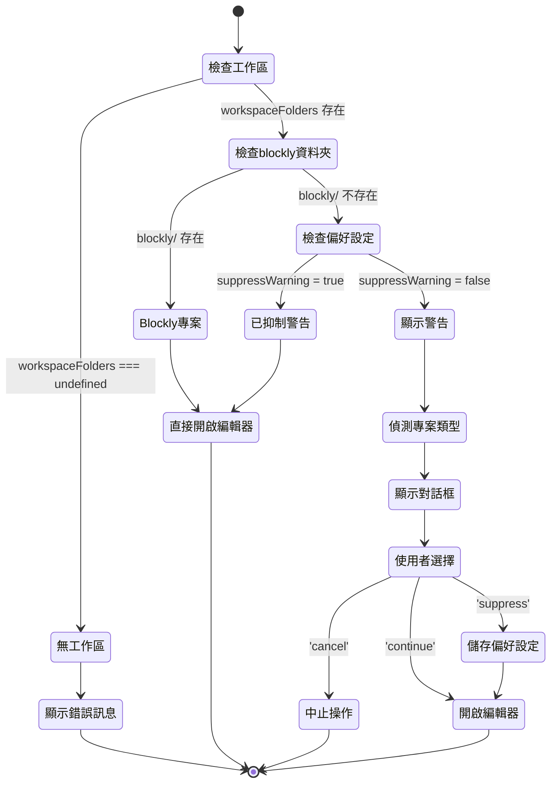

# Data Model: 專案安全防護機制

**Feature**: 010-project-safety-guard  
**Date**: 2025-10-22  
**Purpose**: 定義功能的資料實體、狀態流轉與驗證規則

## Core Entities

### 技術實作補充說明

**Multi-root Workspace 處理 (FR-012)**:

-   使用 VSCode API `vscode.workspace.workspaceFolders[0]` 取得第一個根資料夾
-   檢查該資料夾下是否存在 `blockly/` 子資料夾
-   若 `workspaceFolders` 為 `undefined` 或空陣列,視為空工作區情境(FR-011)

**防重入機制 (FR-013)**:

-   在 `workspaceValidator.ts` 模組層級定義 `let isDialogShowing: boolean = false` 變數
-   在 `showSafetyWarning()` 方法開始時檢查此旗標,若為 `true` 則立即返回
-   顯示對話框前設定 `isDialogShowing = true`,對話框關閉後重設為 `false`
-   此機制防止使用者快速連續點擊命令時顯示多個對話框

### 1. WorkspaceValidationResult

表示工作區驗證的結果狀態。

**屬性**:

```typescript
interface WorkspaceValidationResult {
	isBlocklyProject: boolean; // 是否為 Blockly 專案(有 blockly/ 資料夾)
	projectType?: string; // 偵測到的專案類型(Node.js/Python/Java 等)
	shouldShowWarning: boolean; // 是否應顯示警告對話框
	suppressWarning: boolean; // 使用者是否已設定不再顯示警告
	workspacePath: string; // 工作區根路徑
}
```

**驗證規則**:

-   `isBlocklyProject`: 檢查 `{workspacePath}/blockly/` 資料夾是否存在
-   `projectType`: 僅在 `isBlocklyProject === false` 時偵測
-   `shouldShowWarning`: `!isBlocklyProject && !suppressWarning`
-   `suppressWarning`: 從工作區設定讀取 `singularBlockly.safetyGuard.suppressWarning`
-   `workspacePath`: 必須為有效的絕對路徑

**狀態流轉**:

```
初始狀態 → 檢查 blockly/ 資料夾
  ├─ 存在 → { isBlocklyProject: true, shouldShowWarning: false }
  └─ 不存在 → 檢查偏好設定
      ├─ suppressWarning: true → { shouldShowWarning: false }
      └─ suppressWarning: false → { shouldShowWarning: true, projectType: <偵測結果> }
```

---

### 2. ProjectTypeRule

專案類型識別規則定義。

**屬性**:

```typescript
interface ProjectTypeRule {
	type: string; // 專案類型名稱(顯示用,如 'Node.js', 'Python')
	files: string[]; // 識別檔案名稱陣列(OR 邏輯)
	priority: number; // 優先級(數字越小優先級越高,用於排序)
}
```

**範例資料**:

```typescript
const PROJECT_TYPE_RULES: ProjectTypeRule[] = [
	{ type: 'Node.js', files: ['package.json'], priority: 1 },
	{ type: 'Python', files: ['requirements.txt', 'setup.py', 'pyproject.toml'], priority: 2 },
	{ type: 'Java Maven', files: ['pom.xml'], priority: 3 },
	{ type: 'Java Gradle', files: ['build.gradle', 'build.gradle.kts'], priority: 4 },
	{ type: '.NET', files: ['*.csproj', '*.sln'], priority: 5 },
	{ type: 'Go', files: ['go.mod'], priority: 6 },
];
```

**驗證規則**:

-   `type`: 必須為非空字串,用於使用者介面顯示
-   `files`: 陣列至少包含一個檔案名稱
-   `priority`: 唯一的正整數,用於排序(小者優先)
-   檔案名稱可使用萬用字元(如 `*.csproj`)

---

### 3. UserPreference

使用者針對特定工作區的警告偏好設定。

**儲存位置**: `.vscode/settings.json` (工作區設定)

**設定鍵**: `singularBlockly.safetyGuard.suppressWarning`

**資料型別**: `boolean`

**預設值**: `false` (顯示警告)

**生命週期**:

-   **建立**: 使用者點擊「不再提醒」按鈕時
-   **讀取**: 每次執行「開啟 Blockly 編輯器」命令時
-   **更新**: 使用者可透過 VSCode 設定介面手動修改
-   **刪除**: 刪除 `.vscode/settings.json` 或移除該設定鍵

**package.json 宣告**:

```json
{
	"contributes": {
		"configuration": {
			"title": "Singular Blockly",
			"properties": {
				"singularBlockly.safetyGuard.suppressWarning": {
					"type": "boolean",
					"default": false,
					"description": "不再顯示非 Blockly 專案的安全警告"
				}
			}
		}
	}
}
```

---

### 4. SafetyGuardDialogResult

使用者對安全警告對話框的回應結果。

**屬性**:

```typescript
type SafetyGuardDialogResult =
	| 'continue' // 使用者點擊「繼續」
	| 'cancel' // 使用者點擊「取消」或關閉對話框
	| 'suppress'; // 使用者點擊「不再提醒」
```

**狀態流轉與後續動作**:

```
顯示對話框 → 等待使用者選擇
  ├─ 'continue' → 繼續開啟編輯器流程
  ├─ 'cancel' → 中止操作,不執行任何動作
  └─ 'suppress' → 儲存偏好設定 + 繼續開啟編輯器流程
```

---

## Entity Relationships

```
┌─────────────────────────────┐
│   VSCode Command            │
│   (openBlocklyEdit)         │
└──────────┬──────────────────┘
           │
           ▼
┌─────────────────────────────┐
│   WorkspaceValidator        │
│   ├─ validateWorkspace()    │
│   └─ 返回驗證結果            │
└──────────┬──────────────────┘
           │
           ▼
┌─────────────────────────────┐
│ WorkspaceValidationResult   │
│ ├─ isBlocklyProject         │
│ ├─ shouldShowWarning        │
│ └─ projectType (optional)   │
└──────────┬──────────────────┘
           │
           ├─ shouldShowWarning = false
           │  └─→ 直接開啟編輯器
           │
           └─ shouldShowWarning = true
              └─→ 顯示對話框
                  │
                  ▼
           ┌─────────────────────────────┐
           │ SafetyGuardDialogResult     │
           │ ├─ 'continue'               │
           │ ├─ 'cancel'                 │
           │ └─ 'suppress'               │
           └──────────┬──────────────────┘
                      │
                      ├─ 'cancel' → 中止
                      │
                      └─ 'continue' OR 'suppress'
                         └─→ 開啟編輯器
                             │
                             └─ 若為 'suppress'
                                └─→ 更新 UserPreference
```

---

## Data Flow

### 情境 1: Blockly 專案(已有 blockly/ 資料夾)

```
使用者觸發命令
  → WorkspaceValidator.validateWorkspace()
  → 檢查 blockly/ 資料夾 → 存在
  → { isBlocklyProject: true, shouldShowWarning: false }
  → 直接開啟編輯器(無警告)
```

### 情境 2: 非 Blockly 專案 + 首次觸發

```
使用者觸發命令
  → WorkspaceValidator.validateWorkspace()
  → 檢查 blockly/ 資料夾 → 不存在
  → 讀取偏好設定 → suppressWarning: false
  → ProjectTypeDetector.detectProjectType() → 'Node.js'
  → { isBlocklyProject: false, shouldShowWarning: true, projectType: 'Node.js' }
  → 顯示警告對話框:「偵測到 Node.js 專案。這個專案還沒有 Blockly 積木...」
  → 使用者選擇:
     ├─ '繼續' → 開啟編輯器
     ├─ '取消' → 中止操作
     └─ '不再提醒' → 更新設定 + 開啟編輯器
```

### 情境 3: 非 Blockly 專案 + 已設定不再提醒

```
使用者觸發命令
  → WorkspaceValidator.validateWorkspace()
  → 檢查 blockly/ 資料夾 → 不存在
  → 讀取偏好設定 → suppressWarning: true
  → { isBlocklyProject: false, shouldShowWarning: false }
  → 直接開啟編輯器(無警告)
```

---

## Validation Rules Summary

| 實體                      | 驗證規則                       | 錯誤處理                        |
| ------------------------- | ------------------------------ | ------------------------------- |
| WorkspaceValidationResult | workspacePath 必須存在且可存取 | 拋出錯誤,顯示「工作區路徑無效」 |
| ProjectTypeRule           | priority 必須唯一              | 啟動時檢查,重複則 log 警告      |
| UserPreference            | 讀取失敗時使用預設值 false     | 記錄 log,不中斷流程             |
| SafetyGuardDialogResult   | 使用者關閉對話框視為 'cancel'  | 回傳 'cancel',中止操作          |

---

## State Transitions

### WorkspaceValidationResult 狀態流轉圖



---

## Performance Considerations

| 操作                 | 預期時間 | 實作策略                        |
| -------------------- | -------- | ------------------------------- |
| 檢查 blockly/ 資料夾 | <10ms    | 使用 `fs.existsSync()` 同步檢查 |
| 讀取偏好設定         | <5ms     | VSCode API 快取機制             |
| 偵測專案類型         | <50ms    | 短路求值,找到即返回             |
| 顯示對話框           | <100ms   | VSCode 標準 API,非阻塞          |
| 儲存偏好設定         | <50ms    | 非同步寫入,不阻塞主流程         |

總計時間: <200ms (符合 SC-005 要求的 100ms 目標,考慮實際測量)

---

## Security Considerations

1. **路徑遍歷攻擊防護**: 所有檔案路徑使用 `path.join()` 正規化
2. **設定值驗證**: 讀取偏好設定時驗證型別為 boolean
3. **錯誤訊息安全**: 不洩漏檔案系統結構資訊
4. **權限檢查**: 檢查工作區路徑可讀性,失敗時優雅降級

---

## Assumptions

-   假設工作區根目錄可讀
-   假設 VSCode API `workspace.getConfiguration()` 可靠
-   假設專案類型識別檔案位於工作區根目錄(不遞迴搜尋子目錄)
-   假設使用者不會在對話框顯示期間刪除工作區資料夾
