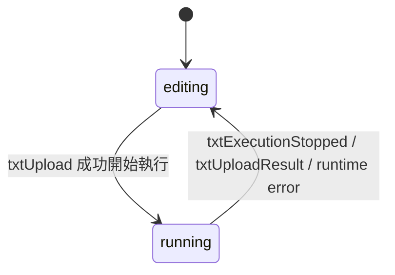

# 資料模型：TXT 虛擬控制畫布

**功能分支**：`053-add-txt-virtual-controls`  
**日期**：2026-05-21

---

## 根層級專案保存格式

本功能延伸既有 `blockly/main.json` 封裝，而不是改動 Blockly serializer 本身。

```typescript
export interface BlocklyProjectSaveData {
    workspace: Record<string, unknown>;
    board: string;
    txtVirtualControls?: TxtVirtualControlsDocument;
}
```

### 設計重點

- `workspace`：原有 Blockly serialization state
- `board`：原有板子識別
- `txtVirtualControls`：TXT 虛擬控制版面資料；只有 TXT 專案會寫入

---

## 持久化文件模型

### TxtVirtualControlsDocument

```typescript
export interface TxtVirtualControlsDocument {
    schemaVersion: 1;
    canvas: TxtVirtualControlCanvas;
    controls: TxtVirtualButton[];
}
```

| 欄位 | 說明 |
|------|------|
| `schemaVersion` | 供後續 migration 使用 |
| `canvas` | 畫布層級狀態 |
| `controls` | 所有虛擬按鈕定義 |

---

### TxtVirtualControlCanvas

```typescript
export interface TxtVirtualControlCanvas {
    mode: 'editing' | 'running';
    lastViewport?: {
        scrollX: number;
        scrollY: number;
        zoom: number;
    };
}
```

### 設計重點

- `mode` 不作為長期執行狀態保存；重開專案時一律回到 `editing`
- `lastViewport` 為可選資料，方便之後保留畫布視角

---

## 單一控制項模型

### TxtVirtualButton

```typescript
export interface TxtVirtualButton {
    stableId: string;
    displayName: string;
    identifier: string;
    kind: 'button';
    position: {
        x: number;
        y: number;
    };
    size: {
        width: number;
        height: number;
    };
    style: {
        textColor: string;
        backgroundColor: string;
    };
}
```

### 欄位說明

| 欄位 | 說明 |
|------|------|
| `stableId` | 不可見、不可變的穩定內部身分；供 block binding 使用 |
| `displayName` | 使用者看得到的名稱；可自由修改 |
| `identifier` | 由系統產生的安全程式參照名稱；需唯一 |
| `kind` | 第一版固定為 `button` |
| `position` | 在虛擬控制畫布上的左上角座標 |
| `size` | 根據名稱動態計算後的實際尺寸 |
| `style` | 背景色與文字色 |

### 關鍵規則

1. `stableId` 一經建立不得變動。
2. `displayName` 可改名，改名不影響 `stableId`。
3. `identifier` 必須安全、唯一；可在 rename 後依規則重算。
4. `size` 為儲存後的實際呈現結果，而非僅保存「自動」設定。

---

## 名稱與識別模型

### VirtualControlIdentity

```typescript
export interface VirtualControlIdentity {
    stableId: string;
    displayName: string;
    identifier: string;
}
```

### 規則摘要

| 層級 | 是否可見 | 是否可變 | 主要用途 |
|------|----------|----------|----------|
| `stableId` | 否 | 否 | block 綁定、runtime state key |
| `displayName` | 是 | 是 | 學生與教師可讀名稱 |
| `identifier` | 可在診斷中顯示 | 是 | Python generator 內部安全參照 |

### 命名處理原則

- 空白、符號、保留字與重名都交由 `identifier` 正規化處理
- `displayName` 不需要被限制成 Python 識別字
- block 不依賴 `identifier` 作為綁定鍵

---

## Blockly 引用模型

### TxtVirtualControlReference

```typescript
export interface TxtVirtualControlReference {
    stableId: string;
    displayNameSnapshot: string;
    identifierSnapshot: string;
    status: 'valid' | 'invalid';
}
```

### 設計重點

- block 實際保存值是 `stableId`
- `displayNameSnapshot` / `identifierSnapshot` 是 UX 與診斷輔助資料
- 載入工作區時若 `stableId` 找不到對應按鈕，`status` 變成 `invalid`
- invalid block 仍保留於工作區，直到使用者重新綁定或刪除 block

---

## 執行期狀態模型

### VirtualControlRuntimeSession

```typescript
export interface VirtualControlRuntimeSession {
    sessionId: string;
    mode: 'running';
    transport: 'txt-companion-runtime';
    startedAt: string;
    controlIds: string[];
}
```

### VirtualControlRuntimeSnapshot

```typescript
export interface VirtualControlRuntimeSnapshot {
    sessionId: string;
    updatedAt: number;
    controls: Record<string, { pressed: boolean }>;
}
```

### 設計重點

- Runtime snapshot 不寫回專案檔；程式停止後全部重設為未按下
- `controls` 以 `stableId` 作為 key
- `pressed` 僅在 `running` 模式中有意義

---

## 畫布互動模式

### CanvasInteractionMode

```typescript
export type CanvasInteractionMode = 'editing' | 'running';
```

### 狀態轉移



### 模式規則

| 模式 | 允許拖曳 | 允許按下 | 說明 |
|------|----------|----------|------|
| `editing` | 是 | 否 | 點擊只作選取 / 編輯，不送入程式 |
| `running` | 否 | 是 | 位置鎖定，只保留 press / release |

---

## 失效引用模型

### InvalidVirtualControlReference

```typescript
export interface InvalidVirtualControlReference {
    blockId: string;
    stableId: string;
    lastKnownDisplayName?: string;
    reason: 'missing-control';
}
```

### 規則

- 刪除被引用按鈕後，不自動刪除 block
- invalid block 必須顯示警告
- 只要仍存在任何 `InvalidVirtualControlReference`，就不能開始 TXT 執行

---

## Companion Runtime 狀態檔模型

TXT companion runtime 會在 TXT 本機維護 canonical state file，例如：

```typescript
export interface TxtVirtualControlsRuntimeFile {
    sessionId: string;
    updatedAt: number;
    controls: Record<string, {
        identifier: string;
        pressed: boolean;
    }>;
}
```

### 目的

- 供 generated Python helper 以低耦合方式讀取目前狀態
- 避免每次 block 判斷都直接做網路請求
- 讓 session reset、stop、runtime crash 時可以明確清空

---

## 與現有 TXT 型別的關係

### 延用現有型別

- `TxtConnectionConfig`
- `TxtDeviceState`
- `TxtUploadProgress`
- `TxtUploadResult`
- `TxtIoSnapshot`

### 本功能新增的型別責任

| 型別 | 責任 |
|------|------|
| `TxtVirtualControlsDocument` | 專案保存與重開還原 |
| `TxtVirtualButton` | 單一按鈕定義 |
| `TxtVirtualControlReference` | Blockly block 與按鈕綁定 |
| `VirtualControlRuntimeSession` | 執行中 session 管理 |
| `VirtualControlRuntimeSnapshot` | 執行中按鈕 pressed 狀態 |

---

## 建議的實作切分

### WebView 端

- 畫布 DOM / drag / rename / color preview
- `TxtVirtualControlsDocument` 的編輯與本地驗證
- invalid reference 警告呈現
- 執行模式切換與 press/release 事件發送

### Extension Host 端

- `blockly/main.json` 擴充保存/讀取
- 開始執行前的 host-side preflight
- companion runtime lifecycle 管理
- WebView state update 轉送到 TXT runtime

### TXT runtime / generated code

- companion runtime 維護 canonical state file
- generated helper 透過 `stableId` 讀取按鈕狀態
