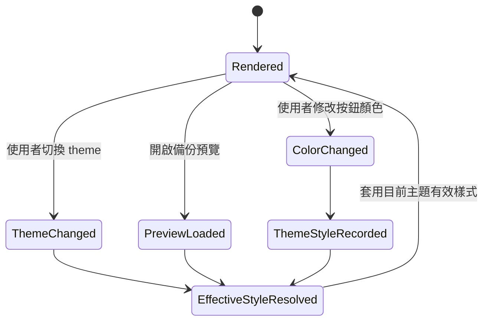

# 資料模型：TXT 虛擬控制主題一致性

## 實體：ThemeMode（主題模式）

**用途**：描述 WebView 目前用於 TXT 虛擬控制呈現的主題環境。

**欄位**：

- `semanticMode`: `light` | `dark` | `high-contrast`。
- `highContrastVariant`: `dark` | `light` | `unknown` | `none`。
- `bodyClasses`: WebView body 上與主題相關的 class，例如 `theme-dark`、`vscode-high-contrast`。
- `resolvedTokens`: 用於 TXT 控制的 VS Code theme token resolved values，例如 focus、contrast、surface、field 與 code surface。

**驗證規則**：

- 必須至少能辨識 light、dark、high contrast 三類。
- high contrast 驗收必須同時涵蓋深色與淺色變體；若 VS Code 僅暴露 generic class，`highContrastVariant` 可以是 `unknown`，並由手動矩陣驗證兩者，而不是要求 runtime 必須可靠分辨。
- ThemeMode 只能用來選擇目前有效樣式；不得覆蓋其他主題的手動樣式記錄。

## 實體：ThemeStyleRecord（主題樣式記錄）

**用途**：描述單一 virtual button 在特定主題下是否已有使用者手動設定的顏色。

**欄位**：

- `theme`: `light` | `dark`。
- `backgroundColor`: 該主題下使用者手動設定或保存的按鈕背景色。
- `textColor`: 該主題下使用者手動設定或保存的文字色。
- `customized`: `true` 表示此主題已有使用者手動調整紀錄。

**驗證規則**：

- 只有使用者在目前主題調整顏色時，才建立或更新該主題的 `ThemeStyleRecord`。
- 若目前主題沒有 `ThemeStyleRecord`，render 應使用該主題的系統可讀初始色。
- 切換主題不得把亮色主題的手動記錄複製或覆蓋到暗色主題，反之亦然。

## 實體：VirtualControlAppearance（虛擬控制外觀）

**用途**：單一 TXT virtual button 在 edit 或 preview 中的可見外觀。

**欄位**：

- `stableId`: 穩定識別碼。
- `displayName`: 使用者看見的按鈕名稱。
- `identifier`: MicroPython helper / block reference 使用的識別資訊。
- `effectiveBackgroundColor`: 目前主題實際顯示的按鈕背景色，來自該主題手動記錄或主題初始色。
- `effectiveTextColor`: 目前主題實際顯示的文字色，來自該主題手動記錄或主題初始色。
- `themeStyles`: 可選的亮色/暗色手動樣式記錄集合。
- `position`: `{ x, y }`。
- `size`: `{ width, height }`。
- `context`: `edit` | `preview`。
- `interactionState`: `normal` | `selected` | `running` | `pressed` | `readonly`。
- `visualCues`: border、outline、focus ring、badge 等系統附加提示。
- `inspectorSurfaces`: 識別字值、名稱輸入欄、顏色輸入欄等 inspector 欄位的目前主題 surface 與文字色。

**驗證規則**：

- `effectiveBackgroundColor` 與 `effectiveTextColor` 必須在主題切換時即時更新。
- 已存在的 `themeStyles.light` 或 `themeStyles.dark` 不得因切換到另一主題而被覆蓋。
- `visualCues` 與 `inspectorSurfaces` 可依主題與狀態變動，但不得改變按鈕的資料模型、位置、大小、引用關係。
- edit 與 preview 對同一主題應使用一致的有效樣式規則；preview 另需顯示 readonly 語意。

## 實體：InteractionStateCue（互動狀態提示）

**用途**：描述使用者在不同狀態下看見/感知到的狀態提示。

**欄位**：

- `state`: `editable` | `selected` | `running` | `pressed` | `readonly-preview` | `focused`。
- `visualCue`: border、outline、badge、transform、文字 hint。
- `nonColorCue`: 非單一顏色線索，例如外框粗細、圖樣、文字、ARIA 描述。
- `appliesTo`: `edit` | `preview` | `both`。

**驗證規則**：

- 每個重要狀態不得只靠顏色差異辨識。
- high contrast 中必須以 border/outline/token 維持可見。
- preview 的狀態 cue 必須傳達 readonly，不得暗示可按下或可編輯。

## 實體：ThemeVerificationCase（主題驗證案例）

**用途**：規劃 manual/contract validation 的單一案例。

**欄位**：

- `theme`: `light` | `dark` | `high-contrast-dark` | `high-contrast-light`。
- `surface`: `edit` | `preview`。
- `controlSetup`: 亮色手動色、暗色手動色、缺少目前主題手動記錄、舊備份等。
- `expectedOutcome`: 應看到的主題初始色、主題手動色、state cue、inspector 欄位可讀、readonly 或非 TXT 不變行為。
- `evidence`: screenshot、manual note 或 automated test assertion。

**驗證規則**：

- 驗證矩陣必須涵蓋四種主題與 edit/preview。
- 必須包含非 TXT 回歸案例。
- 必須包含「只在單一主題手動調色」與「兩個主題都手動調色」案例。

## 狀態轉移

