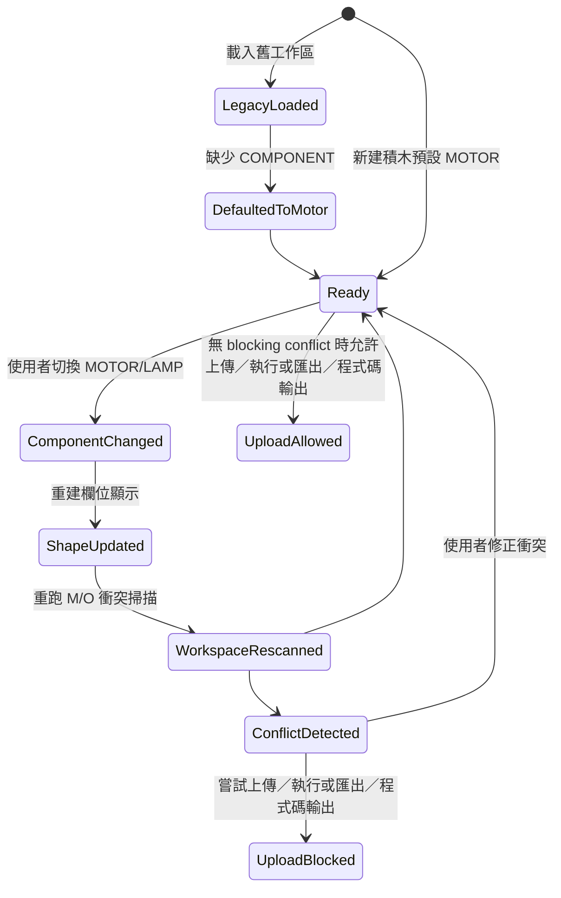

# 資料模型：TXT M 系列輸出重設計

## 實體：MSeriesComponentType（M 系列元件類型）

**用途**：描述接在 M 埠上的元件能力與 UI / generator 行為。

**欄位**：

- `key`: `MOTOR` | `LAMP`
- `displayMessageKey`: i18n key，例如 `TXT_COMPONENT_MOTOR`、`TXT_COMPONENT_LAMP`
- `requiresDirection`: `true` | `false`
- `valueRange`: `{ min: 0, max: 512 }`
- `valueLabelMessageKey`: `TXT_MOTOR_SPEED_SET` 或 `TXT_LAMP_BRIGHTNESS`
- `generatorMode`: `signed-speed` | `unsigned-level`
- `sharedPinPolicy`: `m-port-exclusive`

**驗證規則**：

- 首版只允許 `MOTOR` 與 `LAMP`。
- `MOTOR` 必須要求方向欄位；`LAMP` 必須禁止方向欄位。
- 未來新增元件時，必須先定義上述欄位，才能加入下拉選單。

## 實體：MOutputBlockState（M 系列設定積木狀態）

**用途**：描述 `txt_motor_speed` 在工作區與序列化 JSON 中的有效狀態。

**欄位**：

- `blockType`: 固定為 `txt_motor_speed`
- `port`: `M1` | `M2` | `M3` | `M4`
- `component`: `MOTOR` | `LAMP`
- `direction`: `FORWARD` | `BACKWARD` | `null`
- `powerValue`: `0..512`
- `visibleInputs`: `['COMPONENT', 'PORT', 'DIRECTION', 'VALUE']` 的子集合
- `sourceBlockId`: Blockly block id

**驗證規則**：

- `component = MOTOR` 時，`direction` 為必填，`visibleInputs` 必須包含 `DIRECTION`。
- `component = LAMP` 時，`direction` 必須為 `null` 或被忽略，`visibleInputs` 不得包含 `DIRECTION`。
- `powerValue` 一律限制在 `0..512`。
- 舊工作區若缺少 `component` 欄位，載入後必須補成 `MOTOR`。

## 實體：MStopBlockState（M 系列停止積木狀態）

**用途**：描述 `txt_motor_stop` 的通用斷電狀態。

**欄位**：

- `blockType`: 固定為 `txt_motor_stop`
- `port`: `M1` | `M2` | `M3` | `M4`
- `label`: 固定為 `停止輸出`
- `sourceBlockId`: Blockly block id

**驗證規則**：

- 不得有 `component` 欄位。
- 不得依賴其他 block 推論元件類型。
- codegen 永遠等價於對該 M 埠輸出 0。

## 實體：MPortUsageRecord（M 埠使用紀錄）

**用途**：在工作區掃描與 generator pre-scan 時，集中記錄每個 M 埠被哪些 block、哪些元件模式使用。

**欄位**：

- `port`: `M1` | `M2` | `M3` | `M4`
- `componentsUsed`: `Set<MSeriesComponentType.key>`
- `blockIds`: `string[]`
- `contexts`: `('txt_setup' | 'txt_process' | 'function')[]`
- `hasBlockingConflict`: `boolean`

**驗證規則**：

- 同一個 `port` 若 `componentsUsed` 超過一種，即構成 blocking conflict。
- 掃描範圍以整個工作區為準，不做 branch / runtime flow 互斥分析。

## 實體：SharedPinUsageRecord（共腳位 O 使用紀錄）

**用途**：記錄會與某個 M 埠共享硬體資源的 O 埠使用情況。

**欄位**：

- `oPort`: `O1`..`O8`
- `mappedMPort`: `M1` | `M2` | `M3` | `M4`
- `sourceBlockIds`: `string[]`

**映射規則**：

- `O1`, `O2` → `M1`
- `O3`, `O4` → `M2`
- `O5`, `O6` → `M3`
- `O7`, `O8` → `M4`

**驗證規則**：

- 只有當 `mappedMPort` 本身也被使用時，才構成 shared-pin conflict。
- 不相關的 O 埠共存不得產生警告。

## 實體：TxtMOutputConflict（TXT M 輸出衝突）

**用途**：統一表示會觸發 warning，以及上傳／執行、匯出／程式碼輸出 blocking 的衝突。

**欄位**：

- `kind`: `M_COMPONENT_CONFLICT` | `M_O_SHARED_PIN_CONFLICT`
- `mPort`: `M1` | `M2` | `M3` | `M4`
- `relatedOPorts`: `O[]`
- `blockIds`: `string[]`
- `messageKey`: i18n key
- `severity`: 固定為 `blocking-warning`

**驗證規則**：

- `M_COMPONENT_CONFLICT` 不需要 `relatedOPorts`。
- `M_O_SHARED_PIN_CONFLICT` 必須包含實際對應的 O 埠。
- 所有 `TxtMOutputConflict` 都必須阻擋 TXT 上傳／執行流程與匯出／程式碼輸出入口，直到衝突解除。

## 實體：TxtMOutputValidationResult（TXT M 輸出驗證結果）

**用途**：描述工作區目前是否可以安全生成、匯出或上傳 TXT 程式。

**欄位**：

- `conflicts`: `TxtMOutputConflict[]`
- `warnings`: `string[]`
- `canGenerate`: `boolean`
- `canExport`: `boolean`
- `canUpload`: `boolean`

**驗證規則**：

- `conflicts.length > 0` 時，`canExport = false`、`canUpload = false`。
- 與 orphan warning、TXT setup/process workspace warning 可共存，但不得互相覆蓋。
- 不相關 O 埠共存時，`conflicts` 必須為空。

## 實體：LegacyWorkspaceCompatibilityRule（舊工作區相容規則）

**用途**：定義舊版 TXT M block JSON 載入時的保底行為。

**欄位**：

- `appliesTo`: `txt_motor_speed`
- `missingField`: `COMPONENT`
- `defaultValue`: `MOTOR`
- `migrationMode`: `load-time default only`

**驗證規則**：

- 不建立大型 migration table 或 workspace rewrite。
- 僅在載入/初始化時補預設值；使用者儲存後再以新欄位格式寫回。

## 關係

- 一個 `MOutputBlockState` 必須對應一個 `MSeriesComponentType`。
- 多個 `MOutputBlockState` 可彙整成一筆 `MPortUsageRecord`。
- `SharedPinUsageRecord` 與 `MPortUsageRecord` 組合後，可能產生 `TxtMOutputConflict`。
- `TxtMOutputValidationResult` 聚合所有 `TxtMOutputConflict`，供 warning 呈現與上傳／執行、匯出／程式碼輸出 blocking 使用。

## 狀態轉移

