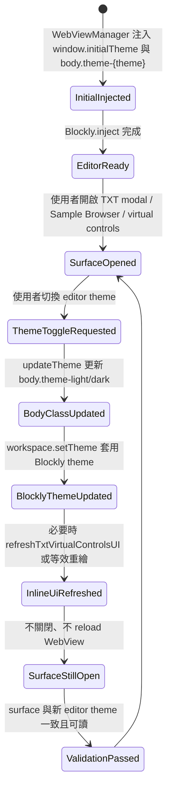

# 資料模型：編輯器主題 surface 一致性

## 實體：EditorThemePreference（編輯器主題偏好）

**用途**：描述 Blockly editor 目前採用的獨立主題，不等同於 VS Code host theme。

**欄位**：

- `value`: `light` | `dark`
- `storageKey`: 固定為 `singular-blockly.theme`
- `initialInjection`: `window.initialTheme`
- `bodyClass`: `theme-light` | `theme-dark`
- `blocklyThemeObject`: `window.SingularBlocklyTheme` | `window.SingularBlocklyDarkTheme`

**驗證規則**：

- `value` 缺失或無效時預設為 `light`。
- `bodyClass` 必須與 `value` 一致，且同一時間不得同時保留 `theme-light` 與 `theme-dark`。
- 此 entity 不得由 `body.vscode-light` / `body.vscode-dark` 推導。

## 實體：EditorOwnedSurface（編輯器擁有的主題表面）

**用途**：定義本輪應跟隨 editor theme 的可見 UI surface。

**欄位**：

- `id`: 穩定識別，例如 `txt-connection-modal`、`sample-browser`、`txt-virtual-controls-chrome`
- `priority`: `P1` | `P2` | `P3` | `opportunistic`
- `selectors`: CSS selectors 或 DOM 節點 ID 列表
- `sourceFiles`: 主要來源檔案，例如 `media/html/blocklyEdit.html`、`media/css/blocklyEdit.css`
- `owner`: 固定為 `editor`
- `surfaceParts`: `surface`、`field`、`button`、`card`、`notice`、`border`、`scrollbar`、`focus-ring`、`status` 的子集合
- `mustUpdateImmediately`: `boolean`

**驗證規則**：

- P1 surface 的 `owner` 必須為 `editor`。
- P1 surface 的 base background / foreground / border / field / card colors 不得直接取自 host `--vscode-*` token，除非該 token 被列在 `ThemeOwnershipException`。
- `mustUpdateImmediately` 對本輪所有 touched surfaces 必須為 `true`。

## 實體：ThemeTokenSet（主題 token 集合）

**用途**：描述 editor-owned surface 在 light/dark/high-contrast 情境下可使用的語意色。

**欄位**：

- `mode`: `light` | `dark` | `high-contrast`
- `surfaceBackground`: CSS color
- `surfaceForeground`: CSS color
- `surfaceBorder`: CSS color
- `fieldBackground`: CSS color
- `fieldForeground`: CSS color
- `fieldBorder`: CSS color
- `descriptionForeground`: CSS color
- `cardBackground`: CSS color
- `cardBorder`: CSS color
- `warningBackground`: CSS color
- `warningForeground`: CSS color
- `warningBorder`: CSS color
- `focusRing`: CSS color
- `scrollbarTrack`: CSS color
- `scrollbarThumb`: CSS color

**驗證規則**：

- `light` 與 `dark` 的 base token 應由 editor theme class 指派，不應由 `body.vscode-light/dark` 指派。
- `high-contrast` 可使用 system colors、forced-colors 或 VS Code contrast tokens，但必須被明確視為 accessibility exception。
- `focusRing` 可使用 contrast/focus 輔助 token；不得因此把整個 surface owner 改為 host。

## 實體：ThemeLeakRecord（主題滲漏紀錄）

**用途**：記錄待修正或已修正的 host theme leakage。

**欄位**：

- `surfaceId`: 對應 `EditorOwnedSurface.id`
- `filePath`: 檔案路徑
- `selectorOrElement`: CSS selector、DOM ID 或 HTML fragment
- `property`: CSS property，例如 `background`、`color`、`border`
- `leakSource`: `inline-vscode-token` | `body-vscode-selector` | `host-token-base-color` | `hardcoded-low-contrast` | `unknown`
- `severity`: `blocking` | `must-fix` | `opportunistic` | `allowed-exception`
- `resolution`: `replace-with-editor-token` | `move-to-allowlist` | `document-exception` | `not-touched`

**驗證規則**：

- P1 surface 的 `inline-vscode-token` 必須被標為 `blocking` 或 `must-fix`。
- `allowed-exception` 必須連到 `ThemeOwnershipException`，不得只靠註解口頭說明。
- `hardcoded-low-contrast` 若位於 touched feedback element，至少需改為 editor-owned token。

## 實體：TouchedFeedbackElement（本輪觸及的提示元素）

**用途**：描述本輪被外觀調整的既有提示、說明、狀態或提醒元素。

**欄位**：

- `id`: 穩定識別，例如 `txt-ssh-hint`、`sample-offline-notice`、`txt-virtual-controls-canvas-hint`
- `parentSurfaceId`: 對應 `EditorOwnedSurface.id`
- `role`: `hint` | `offline-notice` | `loading-status` | `empty-state` | `connection-status` | `warning` | `description`
- `visibilityMode`: `always-visible-when-relevant` | `conditional-visible` | `aria-only` | `hover-only`
- `messageKeys`: i18n key 列表；若沿用既有文字可為既有 key
- `themeTokens`: 使用的 `ThemeTokenSet` token 名稱
- `rolePreserved`: `boolean`

**驗證規則**：

- 重要指引不得只使用 `hover-only`。
- 若新增或修改可見文字，`messageKeys` 必須在 15 語系中補齊。
- `rolePreserved` 必須為 `true`，除非另有明確規格變更；057 不允許把既有 hint 改造成全新互動模式。

## 實體：ThemeOwnershipException（主題 ownership 例外）

**用途**：明確列出允許跟隨 host theme 或系統色的範圍。

**欄位**：

- `id`: 穩定識別
- `scope`: `standalone-host-themed-page` | `high-contrast-accessibility` | `font-token` | `focus-contrast-token` | `semantic-status-token`
- `filePaths`: 受影響檔案
- `allowedTokens`: 可接受的 `--vscode-*` 或 system color token
- `reason`: 例外原因
- `reviewRequirement`: `documented-only` | `source-contract-allowlist` | `manual-smoke-check`

**驗證規則**：

- `standalone-host-themed-page` 不得套用到 TXT connection modal、Sample Browser、TXT virtual controls chrome。
- `high-contrast-accessibility` 必須保留主要操作與邊界可辨識性。
- `font-token` 僅允許字型或 monospace font family，不得夾帶 foreground/background。

## 實體：ThemeSwitchScenario（主題切換情境）

**用途**：描述使用者在 surface 已顯示時切換 editor theme 的即時更新要求。

**欄位**：

- `trigger`: `toolbar-toggle` | `extension-command` | `load-workspace-message` | `preview-sync`
- `previousTheme`: `light` | `dark`
- `nextTheme`: `light` | `dark`
- `openSurfaces`: `EditorOwnedSurface.id[]`
- `requiredActions`: `update-body-class`、`set-blockly-theme`、`refresh-inline-computed-ui`、`preserve-open-state` 的子集合
- `mustReloadWebview`: 固定為 `false`

**驗證規則**：

- `previousTheme !== nextTheme` 時，`update-body-class` 與 `set-blockly-theme` 必須發生。
- 若 `openSurfaces` 包含有 JS inline computed color 的 surface，必須包含 `refresh-inline-computed-ui` 或證明 CSS token 已足夠。
- `mustReloadWebview` 不得為 `true`。

## 實體：ManualThemeValidationScenario（手動主題驗證情境）

**用途**：定義 quickstart manual matrix 中的可驗證情境。

**欄位**：

- `id`: 情境識別
- `vscodeTheme`: `light` | `dark` | `high-contrast`
- `editorTheme`: `light` | `dark`
- `surfaces`: `EditorOwnedSurface.id[]`
- `actions`: 驗證步驟
- `expectedResult`: 可觀察結果
- `result`: `pass` | `fail` | `not-run`
- `notes`: 驗證紀錄

**驗證規則**：

- 至少需涵蓋四組 light/dark 組合：host light/editor light、host light/editor dark、host dark/editor light、host dark/editor dark。
- 高對比為 smoke-check 等級，但不得出現阻礙核心操作的可讀性問題。
- 每個 P1 surface 都必須出現在至少一個交錯主題情境中。

## 關係

- 一個 `EditorThemePreference` 會決定目前 active 的 `ThemeTokenSet.mode`。
- 一個 `EditorOwnedSurface` 可包含多個 `TouchedFeedbackElement`。
- 一筆 `ThemeLeakRecord` 必須對應一個 `EditorOwnedSurface` 或一個 `ThemeOwnershipException`。
- 一個 `ThemeSwitchScenario` 會作用於多個 `EditorOwnedSurface`，並透過 `updateTheme(theme)` 或等效 message flow 實現。
- 一個 `ManualThemeValidationScenario` 聚合多個 `EditorOwnedSurface` 與具體操作步驟。

## 狀態轉移

