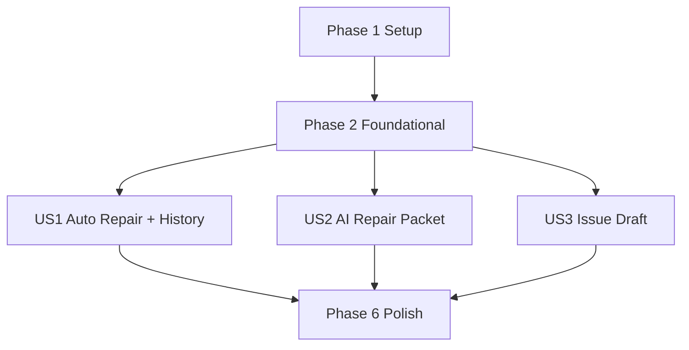

# 任務：PlatformIO Guided Repair

**輸入**：`specs/058-platformio-guided-repair/` 中的設計文件  
**前置文件**：`plan.md`、`spec.md`、`research.md`、`data-model.md`、`contracts/`、`quickstart.md`  
**測試策略**：本功能規格包含獨立測試、驗收情境與可量測成果，且 `quickstart.md` 明確要求 service/panel 驗證，因此任務清單包含測試任務。

**組織方式**：任務依 user story 分組，確保每個故事都能獨立實作、獨立驗證與增量交付。

## 格式：`[ID] [P?] [Story] 說明`

- **[P]**：可平行處理，因為任務碰觸不同檔案，且不依賴尚未完成的任務。
- **[Story]**：user story 標籤（`US1`、`US2`、`US3`），只在 user story 階段使用。
- 每個任務都需包含明確的工作區路徑，或明確列出受影響的 locale file set。

## 階段 1：準備（共享基礎結構）

**目的**：先建立新的 service 與測試入口，不改變既有 runtime 行為。

- [ ] T001 [P] 在 `src/services/platformioRepairService.ts` 建立修復 service skeleton 與 exports
- [ ] T002 [P] 在 `src/services/platformioRepairHistoryStore.ts` 建立 workspace 歷程 store skeleton 與 exports
- [ ] T003 [P] 在 `src/services/platformioPrivacyRedactor.ts` 建立隱私遮罩 redactor skeleton 與 exports
- [ ] T004 [P] 在 `src/services/platformioAiRepairPacketService.ts` 建立 AI 修復封包 service skeleton 與 exports
- [ ] T005 [P] 在 `src/services/platformioIssueDraftService.ts` 建立 issue 草稿 service skeleton 與 exports
- [ ] T006 [P] 在 `src/test/helpers/platformioRepairFixtures.ts` 建立 PlatformIO 修復測試 fixtures

---

## 階段 2：基礎建設（阻塞性前置工作）

**目的**：建立所有 user story 都會共用的型別、官方設定證據、遮罩與環境指紋基礎。

**⚠️ 重要**：此階段完成前，不應開始任何 user story 的實作任務。

- [ ] T007 在 `src/types/platformioDiagnostic.ts` 擴充診斷與修復 domain types、panel actions、WebView message unions，並包含 primary/fallback/verification flow 欄位、not-applicable reason 與替代手動路徑欄位
- [ ] T008 [P] 在 `src/test/services/platformioPrivacyRedactor.test.ts` 先新增 home path、workspace path、proxy credential、疑似 token 的隱私遮罩失敗測試
- [ ] T009 在 `src/services/platformioPrivacyRedactor.ts` 實作 baseline sensitive-data masking rules
- [ ] T010 在 `src/test/services/platformioDiagnosticService.test.ts` 先新增 `platformio-ide.customPATH`、`useBuiltinPIOCore`、`useBuiltinPython`、Windows PATH 分隔符與 proxy evidence 的失敗測試
- [ ] T011 在 `src/services/platformioDiagnosticService.ts` 讀取官方 PlatformIO 與 VS Code HTTP settings 作為診斷 evidence
- [ ] T012 在 `src/test/services/platformioRepairHistoryStore.test.ts` 先新增 fingerprint、stale-history、schema-version 的失敗測試
- [ ] T013 在 `src/services/platformioRepairHistoryStore.ts` 實作 environment fingerprint helpers 與 workspace history schema guards
- [ ] T014 在 `src/webview/platformioDiagnosticPanel.ts` 加入 repair-aware localized string plumbing 與安全 panel-state composition hooks

**檢查點**：共享 contracts、隱私遮罩、官方設定 evidence 與 fingerprint primitives 已就緒；可以開始 user story 實作。

---

## 階段 3：使用者故事 1 - 在同一個狀態檢查裡啟動自動修復並追蹤結果（Priority: P1）🎯 最小可行版本

**目標**：在既有 PlatformIO 狀態面板中顯示推薦修復流程，執行前提供一次輕量確認，執行有限的 user-space 修復步驟，遇到成功或阻塞失敗即停止，並持久保存 workspace-scoped 修復歷程。

**獨立測試**：在 degraded 或 unavailable 的 PlatformIO/CyberBrick 工具鏈情境下，開啟 `singular-blockly.checkPlatformioStatus` 後，應能看到主要問題、主 `自動修復` action、確認內容、進度/結果、修復歷程與重新檢測結果，而且不需要切到另一個 command 或 panel。

### 使用者故事 1 測試

> 先寫這些測試，並確認它們在實作前會失敗。

- [ ] T015 [US1] 在 `src/test/services/platformioRepairService.test.ts` 新增修復 planner/executor 測試，涵蓋 degraded/unavailable findings、allowlisted steps、primary/fallback/verification flow 欄位、platform/permission/environment 不適用 cases、替代手動路徑、history-aware flow ranking、避免無說明重複已失敗 flow、stop policy、timeout、cancel 與修後 retest evidence
- [ ] T016 [P] [US1] 在 `src/test/services/platformioRepairHistoryStore.test.ts` 新增 workspace history persistence、clear-history、stale fingerprint、max-history 測試
- [ ] T017 [P] [US1] 在 `src/test/webview/platformioDiagnosticPanel.test.ts` 新增 `startAutoRepair`、`confirmAutoRepair`、`cancelAutoRepair`、`clearRepairHistory` 與 active-run `retest` guard 的 panel message 測試

### 使用者故事 1 實作

- [ ] T018 [US1] 在 `src/services/platformioRepairService.ts` 實作依據 diagnostic findings、官方 settings evidence 與 repair history 的修復 flow planning，並明確輸出主要修法、備援修法、修後驗證方式、platform/permission/environment 不適用原因、替代手動路徑與避免重複已知失敗路徑的推薦原因
- [ ] T019 [US1] 在 `src/services/platformioRepairService.ts` 實作 allowlisted user-space repair executor，使用注入的 `execFile`、per-step timeout、stop-on-success-or-blocking-failure 與 sanitized step output
- [ ] T020 [US1] 在 `src/services/platformioRepairHistoryStore.ts` 實作 workspace-scoped repair history 的 load/save/clear 與 stale-running-run handling，資料來源為 `context.workspaceState`
- [ ] T021 [US1] 在 `src/webview/platformioDiagnosticPanel.ts` 將 diagnostic session、repair planner、fingerprint status 與 history summary 整合到 initial ready/retest render flow
- [ ] T022 [US1] 在 `src/webview/platformioDiagnosticPanel.ts` 處理 `platformioDiagnostic:startAutoRepair`、`platformioDiagnostic:confirmAutoRepair`、`platformioDiagnostic:cancelAutoRepair` 與 `platformioDiagnostic:clearRepairHistory`
- [ ] T023 [US1] 在 `src/services/platformioDiagnosticService.ts` 保留既有 diagnostic ready/error/copy 行為，同時加入 repair action availability 與正常狀態不強迫進入修復流程的狀態輸出
- [ ] T024 [US1] 在 `media/js/platformioDiagnostic.js` 顯示推薦 repair flow、主要修法、備援修法、修後驗證方式、適用範圍/邊界、platform/permission/environment 不適用原因、替代手動路徑、仍需手動處理的步驟、輕量確認、active progress、step results、fingerprint status 與 repair history
- [ ] T025 [US1] 在 `media/css/platformioDiagnostic.css` 設計 repair recommendation cards、confirmation panel、progress timeline、result badges、verification block 與 history section 樣式
- [ ] T026 [US1] 將主要修復、備援修法、修後驗證、適用範圍、不適用原因、替代手動路徑、手動步驟與修復歷程 UI 字串加入 `media/locales/en/messages.js`、`media/locales/zh-hant/messages.js`、`media/locales/ja/messages.js`、`media/locales/ko/messages.js`、`media/locales/de/messages.js`、`media/locales/es/messages.js`、`media/locales/fr/messages.js`、`media/locales/it/messages.js`、`media/locales/pl/messages.js`、`media/locales/pt-br/messages.js`、`media/locales/ru/messages.js`、`media/locales/tr/messages.js`、`media/locales/cs/messages.js`、`media/locales/hu/messages.js`、`media/locales/bg/messages.js`

**檢查點**：使用者故事 1 已可作為最小可行版本獨立運作與驗證。

---

## 階段 4：使用者故事 2 - 複製 AI 可用修復封包以取得高品質協助（Priority: P2）

**目標**：產生穩定欄位、預設遮罩、可貼給 AI 或協助者的修復封包，內容包含環境 evidence、diagnostics、repair attempts、current blocker、constraints 與 requested response contract。

**獨立測試**：在 warning/error 狀態下複製 AI 修復封包，輸出文字應能區分已觀察事實與修復嘗試，並預設遮罩 home path、workspace path、proxy credential 與疑似 token。

### 使用者故事 2 測試

> 先寫這些測試，並確認它們在實作前會失敗。

- [ ] T027 [P] [US2] 在 `src/test/services/platformioAiRepairPacketService.test.ts` 新增 AI repair packet formatter 測試，涵蓋穩定 sections、repair history inclusion、stale-history marking、redaction 與 requested response contract
- [ ] T028 [US2] 在 `src/test/webview/platformioDiagnosticPanel.test.ts` 新增 `platformioDiagnostic:copyAiRepairPacket` 成功與失敗狀態的 clipboard 測試

### 使用者故事 2 實作

- [ ] T029 [US2] 在 `src/services/platformioAiRepairPacketService.ts` 實作 AI 修復封包 builder，輸出穩定 Markdown/plain-text sections 與 requested response contract
- [ ] T030 [US2] 在 `src/webview/platformioDiagnosticPanel.ts` 將 diagnostics、repair history、fingerprint status 與 redaction 接到 AI packet generation
- [ ] T031 [US2] 在 `media/js/platformioDiagnostic.js` 顯示 `複製 AI 修復摘要` action、copy feedback、redaction notice 與 stale-history notice
- [ ] T032 [US2] 將 AI 修復封包相關字串加入 `media/locales/en/messages.js`、`media/locales/zh-hant/messages.js`、`media/locales/ja/messages.js`、`media/locales/ko/messages.js`、`media/locales/de/messages.js`、`media/locales/es/messages.js`、`media/locales/fr/messages.js`、`media/locales/it/messages.js`、`media/locales/pl/messages.js`、`media/locales/pt-br/messages.js`、`media/locales/ru/messages.js`、`media/locales/tr/messages.js`、`media/locales/cs/messages.js`、`media/locales/hu/messages.js`、`media/locales/bg/messages.js`
- [ ] T033 [US2] 在 `src/services/platformioDiagnosticService.ts` 維持既有 `copySummary` 相容行為，並在 summary 納入 repair history 時套用 shared redaction

**檢查點**：使用者故事 2 可在有 US1 foundation data 時獨立運作；使用者可以複製 AI 可用封包，但不會建立 issue。

---

## 階段 5：使用者故事 3 - 經人類核准後整理成 issue 草稿（Priority: P3）

**目標**：產生本地、已遮罩、可供人類審查的 issue 草稿，內容包含問題摘要、evidence、repair attempts、expected/actual behavior、privacy checklist、duplicate-search hints，且不得自動發佈。

**獨立測試**：在修復成功、失敗或 blocked 後選擇產生 issue 草稿時，系統應先判斷案例是否值得沉澱，對一次性本機雜訊或疑似重複問題提供不開單原因；若產生草稿，內容必須遮罩敏感資訊、包含 duplicate-search keywords，且不得自動呼叫 GitHub API。

### 使用者故事 3 測試

> 先寫這些測試，並確認它們在實作前會失敗。

- [ ] T034 [P] [US3] 在 `src/test/services/platformioIssueDraftService.test.ts` 新增 issue draft service 測試，涵蓋 title/body fields、privacy checklist、duplicate-search hints、無 raw stdout/stderr、redaction、productizable/local-noise/duplicate candidacy、no-draft reason，以及 AI-assisted 與 human-confirmed 來源標示
- [ ] T035 [US3] 在 `src/test/webview/platformioDiagnosticPanel.test.ts` 新增 `platformioDiagnostic:createIssueDraft` clipboard/draft success、redaction warning、no-draft reason 與 no automatic publishing 測試

### 使用者故事 3 實作

- [ ] T036 [US3] 在 `src/services/platformioIssueDraftService.ts` 實作 issue candidacy 與 issue draft proposal builder，使用 current diagnostics、repair attempts、redacted environment evidence、duplicate-search hints、no-draft reason，以及 AI-assisted/human-confirmed source markers
- [ ] T037 [US3] 在 `src/webview/platformioDiagnosticPanel.ts` 將 `platformioDiagnostic:createIssueDraft` 串接到 human-approved local draft generation，並保證不自動發佈 public issue
- [ ] T038 [US3] 在 `media/js/platformioDiagnostic.js` 顯示 `產生 Issue 草稿` action、privacy checklist、duplicate-search reminder、no-draft reason、AI-assisted/human-confirmed 標示與 draft/copy feedback
- [ ] T039 [US3] 將 issue 草稿、候選判斷、不開單原因、隱私檢查、重複檢查與來源標示字串加入 `media/locales/en/messages.js`、`media/locales/zh-hant/messages.js`、`media/locales/ja/messages.js`、`media/locales/ko/messages.js`、`media/locales/de/messages.js`、`media/locales/es/messages.js`、`media/locales/fr/messages.js`、`media/locales/it/messages.js`、`media/locales/pl/messages.js`、`media/locales/pt-br/messages.js`、`media/locales/ru/messages.js`、`media/locales/tr/messages.js`、`media/locales/cs/messages.js`、`media/locales/hu/messages.js`、`media/locales/bg/messages.js`

**檢查點**：使用者故事 3 可獨立產生本地 issue 草稿或不開單原因，且不會在未經人類操作時公開 issue。

---

## 階段 6：潤飾與跨故事檢查

**目的**：跨全部 user stories 驗證安全、i18n、回歸測試與 quickstart manual matrix。

- [ ] T040 [P] 在 `src/test/webview/platformioDiagnosticPanel.test.ts` 新增 repair render payload 的 WebView escaping 與 untrusted-output regression cases
- [ ] T041 [P] 在 `specs/058-platformio-guided-repair/quickstart.md` 更新實作後的驗證備註與任何已調整的 manual matrix 細節
- [ ] T042 執行 `npm run compile`，並修正 `src/types/platformioDiagnostic.ts`、`src/services/platformioRepairService.ts`、`src/services/platformioRepairHistoryStore.ts`、`src/services/platformioPrivacyRedactor.ts`、`src/services/platformioAiRepairPacketService.ts`、`src/services/platformioIssueDraftService.ts` 中的 TypeScript errors
- [ ] T043 執行 `npm run lint`，並修正 `src/webview/platformioDiagnosticPanel.ts`、`src/services/platformioDiagnosticService.ts` 與新增 `src/services/platformio*.ts` files 中的 ESLint issues
- [ ] T044 執行 `npm test`，並修正 `src/test/services/platformioDiagnosticService.test.ts`、`src/test/services/platformioRepairService.test.ts`、`src/test/services/platformioRepairHistoryStore.test.ts`、`src/test/services/platformioPrivacyRedactor.test.ts`、`src/test/services/platformioAiRepairPacketService.test.ts`、`src/test/services/platformioIssueDraftService.test.ts`、`src/test/webview/platformioDiagnosticPanel.test.ts` 中的 regressions
- [ ] T045 執行 `npm run validate:i18n`，並修正 `media/locales/en/messages.js`、`media/locales/zh-hant/messages.js`、`media/locales/ja/messages.js`、`media/locales/ko/messages.js`、`media/locales/de/messages.js`、`media/locales/es/messages.js`、`media/locales/fr/messages.js`、`media/locales/it/messages.js`、`media/locales/pl/messages.js`、`media/locales/pt-br/messages.js`、`media/locales/ru/messages.js`、`media/locales/tr/messages.js`、`media/locales/cs/messages.js`、`media/locales/hu/messages.js`、`media/locales/bg/messages.js` 的 locale key drift
- [ ] T046 執行 `specs/058-platformio-guided-repair/quickstart.md` 的 manual scenarios，並將最終驗證備註記錄回 `specs/058-platformio-guided-repair/quickstart.md`

---

## 相依關係與執行順序

### 階段相依關係

- **階段 1：準備** 沒有前置相依，可以立即開始。
- **階段 2：基礎建設** 依賴階段 1，且會阻塞所有 user stories。
- **階段 3：使用者故事 1** 依賴階段 2，是最小可行版本。
- **階段 4：使用者故事 2** 依賴階段 2 與 redaction/history data contracts；可在 US1 資料模型穩定後實作，且 export action 必須能優雅處理尚無 repair runs 的情境。
- **階段 5：使用者故事 3** 依賴階段 2 與 redaction/history data contracts；可在 US1 資料模型穩定後實作，且絕不能自動發佈 issue。
- **階段 6：潤飾** 依賴預計納入 release candidate 的 user stories。

### 使用者故事相依關係

- **US1（P1）**：最小可行版本；不依賴 US2 或 US3。
- **US2（P2）**：依賴 shared redaction/history/fingerprint contracts，可在沒有 completed repair runs 時仍運作；不依賴 US3。
- **US3（P3）**：依賴 shared redaction/history/fingerprint contracts，並可使用 US1 repair attempts；不依賴 US2。

### 相依圖



### 每個使用者故事內部順序

- 先寫測試，並確認測試在實作前失敗。
- 型別與 pure services 先於 panel integration。
- Panel integration 先於 WebView rendering。
- WebView rendering 先於 CSS 與 i18n polish。
- 若採序列式開發，每個故事檢查點都必須完成驗證後再進入下一個 priority。

---

## 可平行處理的工作

- T001–T006 可在 setup 階段平行處理，因為各自建立不同檔案。
- T008 可與 T010/T012 平行撰寫；T009 必須在 T008 的失敗測試確認後執行。
- T010/T011 可與 T012/T013 平行處理，但需協調 `src/types/platformioDiagnostic.ts` 的 shared types。
- T015、T016、T017 可在 Phase 2 完成後平行撰寫，因為分別覆蓋不同測試檔。
- T027 可與 US2 implementation planning 平行；T028 需與其他 `src/test/webview/platformioDiagnosticPanel.test.ts` 編輯協調。
- T034 可與 US3 implementation planning 平行；T035 需與其他 `src/test/webview/platformioDiagnosticPanel.test.ts` 編輯協調。
- US2 與 US3 可在 US1 的 shared history/run model 穩定後平行推進，但兩者都必須協調 `src/webview/platformioDiagnosticPanel.ts` 與 `media/js/platformioDiagnostic.js` 的修改。
- T040 與 T041 可在 polish 階段平行處理。

---

## 平行範例：使用者故事 1

```text
任務：T015 在 src/test/services/platformioRepairService.test.ts 新增 repair planner/executor 測試
任務：T016 在 src/test/services/platformioRepairHistoryStore.test.ts 新增 workspace history 測試
任務：T017 在 src/test/webview/platformioDiagnosticPanel.test.ts 新增 panel repair message 測試
```

## 平行範例：使用者故事 2

```text
任務：T027 在 src/test/services/platformioAiRepairPacketService.test.ts 新增 AI 修復封包 formatter 測試
任務：T031 在 media/js/platformioDiagnostic.js 顯示 AI 修復摘要複製 action
```

## 平行範例：使用者故事 3

```text
任務：T034 在 src/test/services/platformioIssueDraftService.test.ts 新增 issue 草稿 service 測試
任務：T036 在 src/services/platformioIssueDraftService.ts 實作 issue draft proposal builder
```

---

## 實作策略

### 最小可行版本優先（只做使用者故事 1）

1. 完成階段 1 setup。
2. 完成階段 2 foundational contracts、redaction、官方 settings evidence 與 fingerprint primitives。
3. 完成階段 3 使用者故事 1。
4. 暫停並依 `quickstart.md` 的 degraded/unavailable diagnostic scenarios 獨立驗證最小可行版本。
5. 最小可行版本驗證通過後，再進入 US2 與 US3。

### 增量交付

1. Setup + Foundational → repair contracts 與 evidence pipeline 可用。
2. US1 → guided repair 與 workspace history 可在 status panel 中使用。
3. US2 → AI 可用修復封包改善支援交接品質。
4. US3 → human-approved issue 草稿支援治理流程。
5. Polish → compile、lint、tests、i18n 與 manual matrix。

### 多人平行策略

1. 一位開發者負責 Phase 2 type/service contracts。
2. 一位開發者負責 service tests 與 pure helpers。
3. 一位開發者在 message contracts 穩定後負責 panel/WebView rendering。
4. US1 history/run model 穩定後，US2 與 US3 export 可分工處理。

---

## 注意事項

- 不要新增 top-level command；維持使用 `singular-blockly.checkPlatformioStatus`。
- 不要修改 shell profiles、system PATH、registry 或 system package managers。
- 任何 repair subprocess 都必須使用 `execFile` 或等效的非 shell 執行方式。
- WebView logic 只負責顯示；所有 filesystem/process 工作都留在 Extension Host services。
- Extension Host logging 使用 `src/services/logging.ts` 的 `log()`；不要使用 `console.log`。
- AI 修復封包與 issue 草稿預設必須遮罩敏感資訊。
