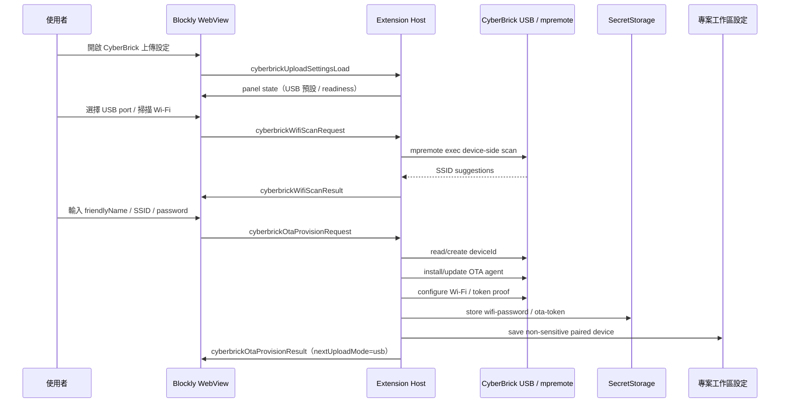

# 契約：CyberBrick USB-first OTA Provisioning

## 目的

定義首次 OTA 設定流程：使用者必須先以 USB 連接 CyberBrick，由 Extension Host 透過既有 MicroPython/`mpremote` 能力建立信任關係、取得裝置端 Wi‑Fi 掃描結果、部署/驗證 OTA agent，並把敏感憑證存入本機 SecretStorage。

## Provisioning 流程



## Step contract

### 1. `detect-usb`

- 使用既有或擴充後的 CyberBrick port list 偵測。
- 若多台 USB CyberBrick 同時連接，UI 必須要求使用者明確選擇。
- 失敗 error code：`usb-port-missing`、`usb-device-not-cyberbrick`、`mpremote-unavailable`。

### 2. `read-device-id`

- 透過 USB 執行短 MicroPython 程式讀取裝置既有唯一值或 OTA agent 保存的 `deviceId`。
- 若裝置尚無 `deviceId`，由 Extension Host 產生穩定 ID 並透過 USB 寫入裝置端安全位置。
- 失敗 error code：`device-id-read-failed`、`device-id-write-failed`。

### 3. `scan-wifi`

- 透過 USB 在 CyberBrick 上執行裝置端 Wi‑Fi scan。
- 回傳 `WifiNetworkSuggestion[]`。
- 失敗不阻擋手動 SSID 輸入；若 provisioning submit 已有 SSID，可略過 scan。
- 失敗 error code：`wifi-scan-timeout`、`wifi-scan-failed`。

### 4. `install-agent`

- 將最小 OTA agent/runtime helper 部署到 CyberBrick。
- v1 agent 職責：實作 `ota-upload.md` 定義的 v1 LAN protocol、驗證 deviceId/token、接收單檔 `/app/rc_main.py`、寫入檔案、回報版本與健康狀態、必要時重啟 student app。
- agent 不應將 Wi‑Fi 密碼或 token 印到 stdout。
- 失敗 error code：`agent-install-failed`、`agent-version-unsupported`。

### 5. `configure-wifi`

- 使用使用者選定或手動輸入的 SSID 與密碼設定裝置網路。
- Wi‑Fi 密碼只在 Extension Host memory 與 SecretStorage 中短暫存在，不寫入專案工作區設定。
- agent/device 可保存重新連線與 OTA 驗證所需的最小必要設定；Extension Host 專案工作區設定只保存 SSID hint 與非敏感狀態。
- 裝置端保存的任何秘密不得透過 WebView response、diagnostics、stdout/stderr 或 log 回傳。
- 失敗 error code：`wifi-connect-failed`、`wifi-auth-failed`、`wifi-timeout`。

### 6. `verify-agent`

- 透過 LAN endpoint 或裝置回報確認：
  - 遠端 `deviceId` 與 project selected `deviceId` 相同。
  - OTA token proof 成功。
  - agent version 符合最低需求。
  - 裝置回報目前 IP/port。
- 失敗 error code：`agent-health-failed`、`identity-mismatch`、`token-rejected`、`agent-unreachable`。

### 7. `store-secrets`

- 將 Wi‑Fi password / OTA token / pairing secret 寫入 `context.secrets`。
- 回傳給 WebView 的結果只包含 secret presence。
- 失敗 error code：`secret-store-failed`。

## Provisioning result contract

```ts
interface OtaProvisioningResult {
  requestId: string;
  status: 'succeeded' | 'failed' | 'partial' | 'cancelled';
  device: PairedCyberBrickDevice;
  steps: OtaProvisioningStepResult[];
  secretsStored: CyberBrickSecretRef[];
  nextUploadMode: 'usb';
  userFacingSummary: string;
}
```

## 安全與 UX 規則

- Provisioning 成功後仍維持 `USB` 模式，必須由使用者自己切換到 `OTA`。
- 任何 step 失敗都必須保留已可用的下一步，例如重新掃描、重新插 USB、手動輸入 SSID。
- Provisioning 不得在背景自動重試多次；使用者需要明確觸發。
- 多台 USB 或多台已配對裝置時，必須以 `deviceId` 區分。
- 所有裝置端輸出需在 Extension Host 端遮罩後才進入 UI/log。

## 測試契約

- USB port 偵測可用 mock 測試多台/無裝置/非 CyberBrick。
- Wi‑Fi scan 成功、空結果、timeout、失敗都需測試。
- `wifiPassword` 不會出現在 provisioning result、settings snapshot 或 log payload。
- Provisioning 成功後 `uploadMode` 仍為 `usb`。
- `friendlyName` 重複時仍能新增兩筆不同 `deviceId`。
