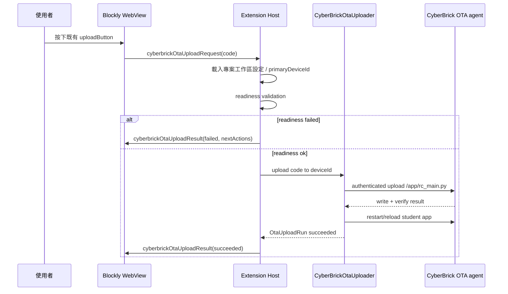

# 契約：CyberBrick OTA 上傳

## 目的

定義使用者已明確選擇 `OTA` 模式後，按下既有上傳按鈕時的行為。OTA 上傳必須直接使用目前主要目標裝置，不得再次詢問是否使用 OTA，也不得在失敗時自動 fallback 到 USB。

## Upload flow



## Readiness gate

OTA 上傳前必須檢查：

1. 目前 board 是 CyberBrick。
2. 專案工作區設定中的 `uploadMode = 'ota'`。
3. `primaryDeviceId` 存在。
4. `primaryDeviceId` 對應的 paired device 存在。
5. 對應 secrets presence 完整（OTA token 必須存在；Wi‑Fi secret 視 open network marker 而定）。
6. 有可嘗試的 `lastKnownIp` / mDNS / agent-discovery 結果。
7. agent health 回報 `deviceId` 相符。
8. agent version 支援 v1 單檔上傳。

任何檢查失敗都必須在真正傳送前停止，並回傳 `OtaReadinessStatus`。

## Request contract

```ts
interface CyberBrickOtaUploadRequest {
  operationId: string;
  board: 'cyberbrick';
  code: string;
}
```

**規則**

- WebView 不可指定任意 `deviceId` 覆蓋 project primary target。
- `code` 必須是目前 Blockly workspace 生成的 MicroPython 程式。
- Extension Host 負責將 `code` 包裝上不含秘密的 OTA agent bootstrap 後，寫入 v1 固定 remote path `/app/rc_main.py`。
- OTA upload 的裝置端寫入只能修改 `/app/rc_main.py`；不得寫入、刪除或修改任何其他裝置端檔案。

## v1 LAN protocol contract

`CyberBrickOtaUploader` 與裝置端 OTA agent 必須以版本化協定互動，協定細節集中在 Extension Host service 與裝置端 agent，不得散落在 WebView。

### Base URL

```text
http://{lastKnownIp}:{otaPort}/api/v1
```

`lastKnownIp` 與 `otaPort` 只作為連線候選位置；真正身分必須由 response 中的 `deviceId` 與 token proof 驗證。

### Auth headers

```text
Authorization: Bearer <ota-token>
X-CyberBrick-Device-Id: <deviceId>
X-CyberBrick-Protocol-Version: 2
```

**規則**

- token 不得放在 URL、query string、log、diagnostics 或 WebView payload。
- agent 必須在 token 或 `deviceId` 不符時回傳 `401` / `403` 或等價錯誤，且不得寫入檔案。

### Health check

```http
GET /api/v1/health
```

Response：

```ts
interface CyberBrickOtaHealthResponse {
  deviceId: string;
  agentVersion: string;           // e.g. "1.2.0"
  protocolVersion: 2;
  supportedProtocolVersions: number[];  // e.g. [2]
  appPath: '/app/rc_main.py';
  ipAddress?: string;
  status: 'ready' | 'busy' | 'needs-provisioning';
}
```

Readiness validation 必須確認 `deviceId` 相符、`protocolVersion` 支援 v2、`appPath` 為 `/app/rc_main.py`，且 `status = 'ready'`。

### Upload single file（v2：raw binary streaming）

v2 以 `Content-Type: application/octet-stream` 直接串流原始二進位資料，取代 v1 的 JSON+base64 格式。此設計避免 MicroPython 小記憶體環境在 base64 解碼時的 heap fragmentation 問題。

```http
POST /api/v1/upload
Content-Type: application/octet-stream
Content-Length: <size-in-bytes>
X-Singular-Content-Sha256: <sha256-hex>
X-Singular-Operation-Id: <operationId>
```

Request body：原始二進位檔案內容（已包含 OTA bootstrap 的 `rc_main.py`）。

Response：

```ts
interface CyberBrickOtaUploadResponse {
  operationId: string;
  deviceId: string;
  remotePath: '/app/rc_main.py';
  bytesWritten: number;
  contentSha256: string;
  restarted: boolean;    // v1.2.0+ agent 寫入成功後自動 machine.reset()，固定 true
  status: 'written' | 'written-restart-failed';
}
```

**規則**

- `remotePath` 固定 `/app/rc_main.py`；任何其他 path 必須被 Extension Host 拒絕。
- 裝置端 OTA agent 寫入檔案時必須只使用固定 `REMOTE_PATH = '/app/rc_main.py'`；不得接受 request 內任意 path 造成其他官方檔案被修改。
- Extension Host 必須比對 response `deviceId`、`operationId`、`contentSha256`。
- v1.2.0+ agent 在 `client.close()` 後立即呼叫 `machine.reset()`，使新程式立即生效；response 的 `restarted` 欄位固定為 `true`。
- `status = 'written-restart-failed'` 需分類為 `restart-failed`，但不得回滾到 USB。

### Timeout 與重試

- Health check timeout 建議不超過 5 秒。
- Upload timeout 建議依檔案大小設定，v2 預設不超過 30 秒。
- Extension Host 可允許使用者手動重試；不得在背景無限重試，也不得因 timeout 自動 fallback USB。

### Version negotiation

- 若 agent 回報不支援 protocol v2，readiness 必須回傳 `agent-outdated`。
- v2 為當前版本；v1（JSON+base64）已廢棄，不再支援。

## Progress contract

```ts
interface OtaUploadRun {
  operationId: string;
  deviceId: string;
  friendlyName: string;
  startedAt: string;
  finishedAt: string | null;
  status: 'pending' | 'validating' | 'connecting' | 'transferring' | 'verifying' | 'restarting' | 'succeeded' | 'failed' | 'cancelled' | 'timed-out';
  progress: number;
  stageMessage: string;
  errorCode: string | null;
  userFacingSummary: string;
}
```

## Error classification

| errorCode | 類型 | 使用者下一步 |
|---|---|---|
| `missing-primary-device` | 設定不完整 | 開啟設定選擇裝置 |
| `device-not-paired` | 設定不完整 | 透過 USB provisioning |
| `token-missing` | 本機 secret 缺失 | 重新 USB provisioning |
| `device-offline` | 網路不可達 | 檢查 Wi‑Fi、重試、手動切回 USB |
| `identity-mismatch` | 安全檢查失敗 | 改選裝置或重新 pairing |
| `token-rejected` | 安全檢查失敗 | 重新 USB provisioning |
| `agent-outdated` | agent 版本不符 | 透過 USB 更新 agent |
| `upload-timeout` | 傳輸逾時 | 重試或檢查網路 |
| `write-failed` | 裝置端寫入失敗 | 檢查裝置空間或重新 provisioning |
| `restart-failed` | app 重啟失敗 | 顯示已寫入狀態並建議手動重啟/USB 檢查 |

## 成功後狀態更新

OTA upload 成功後，Extension Host 必須更新：

- `PairedCyberBrickDevice.lastSeenAt`
- `PairedCyberBrickDevice.lastSuccessfulUploadAt`
- `PairedCyberBrickDevice.lastKnownIp`（若 agent 回報新 IP）
- `PairedCyberBrickDevice.statusSummary = 'ready'`

不得修改：

- `uploadMode`（維持 `ota`）。
- `friendlyName`（除非使用者在設定中修改）。
- secrets（除非 agent 明確輪替 token，且流程有安全理由與測試）。

## 與 USB 上傳的相容規則

- `uploadMode = 'usb'`：完全走既有 `MicropythonUploader`，不做 OTA readiness。
- `uploadMode = 'ota'`：不開 USB port picker、不嘗試 USB fallback。
- OTA 失敗時 UI 可顯示「你可以手動切回 USB」按鈕/提示，但實際切換必須由使用者觸發並保存。
- 不論成功或失敗，OTA upload 都不得修改 `/boot.py`、WebREPL 設定、韌體/出廠設定或其他官方 runtime 檔案。

## 測試契約

- Readiness failed 時，不呼叫 `CyberBrickOtaUploader.upload()`。
- `deviceId` mismatch 時，不寫入檔案。
- 上傳成功會更新 paired device metadata。
- 上傳失敗不會呼叫既有 USB upload handler。
- Progress stage 順序與錯誤分類可用 mock uploader 驗證。
- `code` 內容不因 OTA 模式被注入 Wi‑Fi 連線邏輯。
- OTA payload 與裝置端 agent source 需測試確認 remote path 固定為 `/app/rc_main.py`，且不含 `/boot.py` 或其他非白名單寫入路徑。
