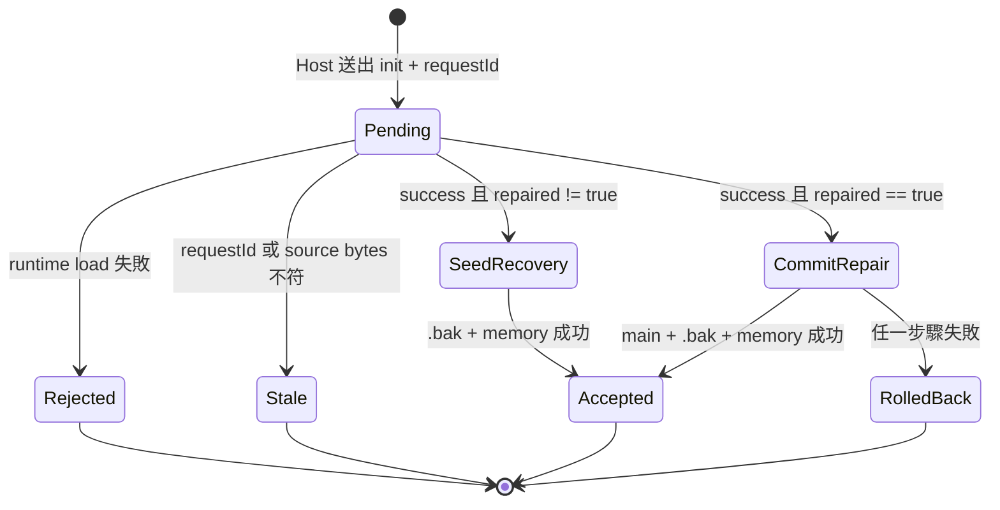

# Phase 1 資料模型：主程式積木停用保護

## 1. 必要主程式政策

| 屬性 | 型別 | 規則 |
|------|------|------|
| `protectedTypes` | `ReadonlySet<string>` | 恰為 `arduino_setup_loop`、`micropython_main`、`txt_setup` |
| `boardMainType` | string | Arduino 五板為 `arduino_setup_loop`；CyberBrick 為 `micropython_main`；TXT 為 `txt_setup` |
| `disableMenuVisibility` | `hidden` 或原始結果 | 必要主程式固定 `hidden`；其他積木完整委派 Blockly 原始 precondition |
| `disabledReasons` | `ReadonlySet<string>` | 必要主程式合法穩定狀態必須為空；其他積木不受本政策修改 |

`protectedTypes` 與 `boardMainType` 不等價：啟用保護會掃描三種必要類型，避免跨板型或外部內容留下停用狀態；刪除與重複警告只計算目前板型的 `boardMainType`。

## 2. 必要主程式實例狀態

| 狀態 | 條件 | 允許轉移 | 處理 |
|------|------|----------|------|
| `enabled-single` | 無停用原因，且目前板型同類型只有一個 | 重複建立、外部停用 | `deletable = false` |
| `enabled-duplicate` | 無停用原因，且目前板型同類型超過一個 | 刪除至單一、外部停用 | `deletable = true`，數量簽章改變時沿用警告 |
| `disabled-detected` | 至少一個停用原因 | 只能轉為啟用狀態 | 複製並清除全部原因，事件抑制，標記本次 repaired |
| `missing` | 目前板型同類型為零 | 建立主程式 | 不自動建立；沿用既有缺失／TXT 完整性驗證 |

普通積木、函式與 `txt_process` 即使有停用原因，也不進入 `disabled-detected` 修復狀態。

## 3. 主程式狀態保護結果

```ts
interface MainBlockProtectionResult {
  repaired: boolean;
  boardMainType: 'arduino_setup_loop' | 'micropython_main' | 'txt_setup';
  boardMainCount: number;
}
```

- `repaired` 只表示本次呼叫至少移除一個必要主程式停用原因。
- 重複呼叫已穩定工作區時必須回傳 `false`，不得因掃描或 setDeletable 產生假陽性。
- 一次正式 load 可能在不同 integration 點呼叫保護；載入結果以布林 OR 累積，確保只要曾實際修復就回報 `true`。

## 4. 首次載入 pending 狀態

```ts
interface PendingInitialWorkspaceLoad {
  requestId: string;
  sourceBytes: Buffer;
  recoveryAttempted: boolean;
}
```

| 驗證 | 規則 |
|------|------|
| request correlation | 只接受目前 pending 的 `requestId`，接受後立即清除 pending |
| document shape | `success: true` 時 `normalizedDocument` 必須是有效 `WorkspaceDocument` |
| repair flag | 只有布林 `true` 觸發主檔修復交易；省略或 `false` 走 recovery seed |
| source freshness | 提交前 `main.json` bytes 必須仍等於 `sourceBytes` |
| recovery loop | runtime-invalid 初載最多依既有政策嘗試一次 recovery |

## 5. 初次載入提交狀態機



## 6. 修復交易快照

| 欄位 | 型別 | 用途 |
|------|------|------|
| `expectedMainBytes` | `Buffer` | 判定初次載入來源是否仍新鮮 |
| `previousMainBytes` | `Buffer \| undefined` | 主檔 rollback；初載修復必須存在且等於 expected |
| `previousBackupBytes` | `Buffer \| undefined` | 備份 rollback；不存在時失敗後恢復為不存在 |
| `previousMemoryBytes` | `Buffer \| undefined` | 最後有效記憶體快照 rollback |
| `normalizedBytes` | `Buffer` | 主檔與備份共同提交內容；格式為既有 pretty JSON 加結尾換行 |

交易成功不允許出現 `main`、`.bak`、memory 三者任一持有不同 normalized bytes。交易失敗不允許把 `normalizedBytes` 留在任一正式狀態。

## 7. 外部候選狀態

沿用現有 `WorkspaceCandidate` 的 generation、observation revision、deadline、raw bytes 與 issue。停用必要主程式不新增 invalid issue code；它在 validation 後進入 live load，狀態轉移如下：

```text
validated candidate
  → live workspace load
  → main-block protection（可能 repaired）
  → live normalized document
  → source/generation recheck
  → existing paired commit 或 existing rollback/recovery
```

## 8. 不變條件

- 必要主程式序列化後不得含非空 `disabledReasons` 或等效 legacy 停用狀態。
- 修復不得更動必要主程式的 ID、type、fields、inputs、next、shadow、extra state 或座標。
- 普通、函式與 `txt_process` 的停用原因逐項保持。
- `maxInstances: 1`、最後一個不可刪除、重複可刪除與既有警告簽章保持。
- 無實際修復的初次載入不得改變主檔 bytes。
- stale 或失敗結果不得成為 last-valid memory。
